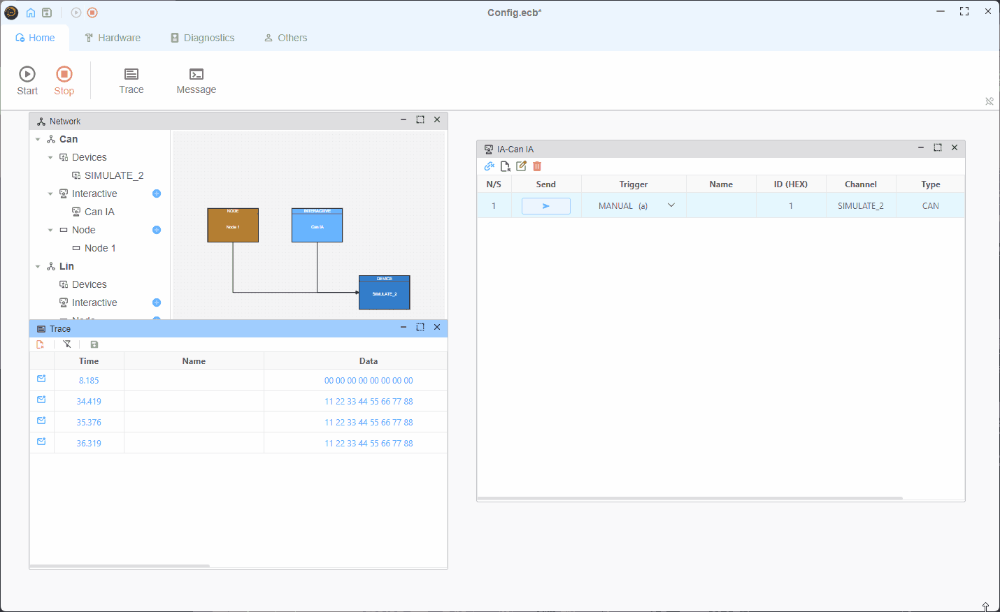
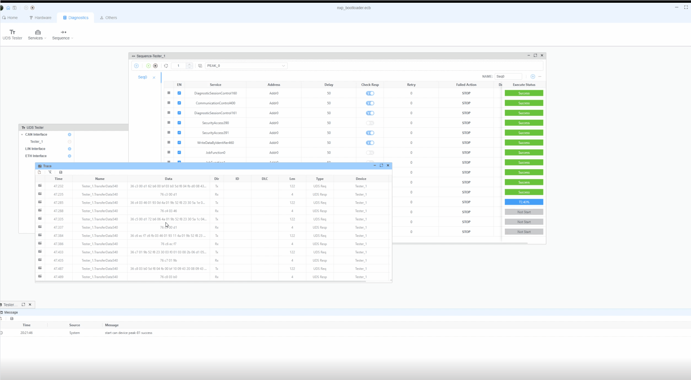
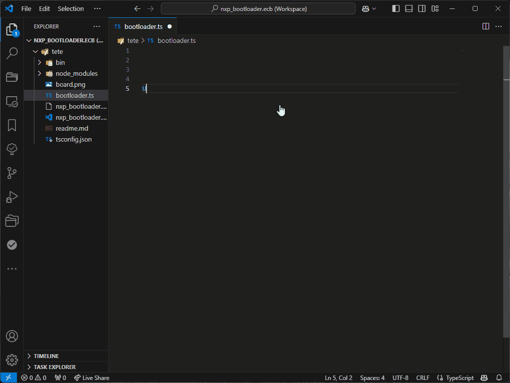
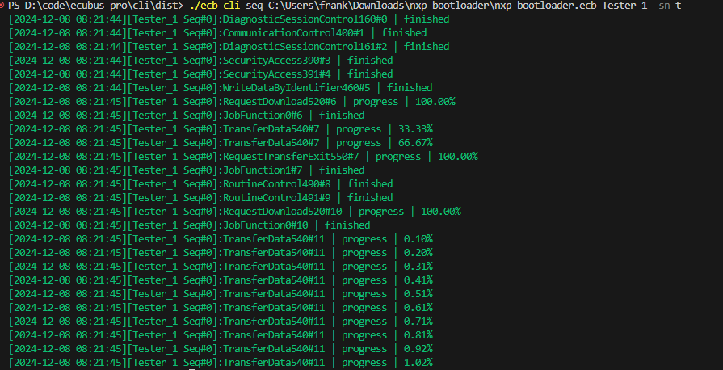

  

  <h1>EcuBus-Pro</h1>

   

    
    
  

  <b style="font-size:16px">A powerful automotive ECU development tool</b> 
  <i>Easy of use, Cross platform, Multi dongle, Powerful script ability, CLI support</i> 
  Document: <a href="https://app.whyengineer.com">https://app.whyengineer.com</a>

## Introduction

`CAN-OE` is the best tool, but it's expensive. We still need another tool to develop our ECU code. EcuBus-Pro is a powerful automotive ECU development tool, it contains the following features:
* open source and free
* easy of use
* cross platform
* add multi USB dongle (PEAK, Kvaser, ZLG, etc)  
* powerful script ability, based on typescript
* CLI ability support

### GUI Snapshot

---

### Script Ability

Script Engine is based on `nodejs`, you can use almost all nodejs functions in your script, Also, we provide  a lot of APIs to interact with EcuBus-Pro, such as:

### CLI Ability

run uds sequence by cli

## Support this project

Support this project by [becoming a sponsor](./docs/about/sponsor). Your logo will show up here with a link to your website. 🙏

### Technical support

You can also consider sponsoring us to get extra technical support services. If you do, you can get access to the [ecubus/technical-support](https://github.com/ecubus/technical-support) repository, which has the following benefits:

- [X] Handling Issues with higher priority
- [X] One-to-one technical consulting service
- [X] Help to write addon code to access 0x27,0x29 dll functions

## License
Apache-2.0

---

