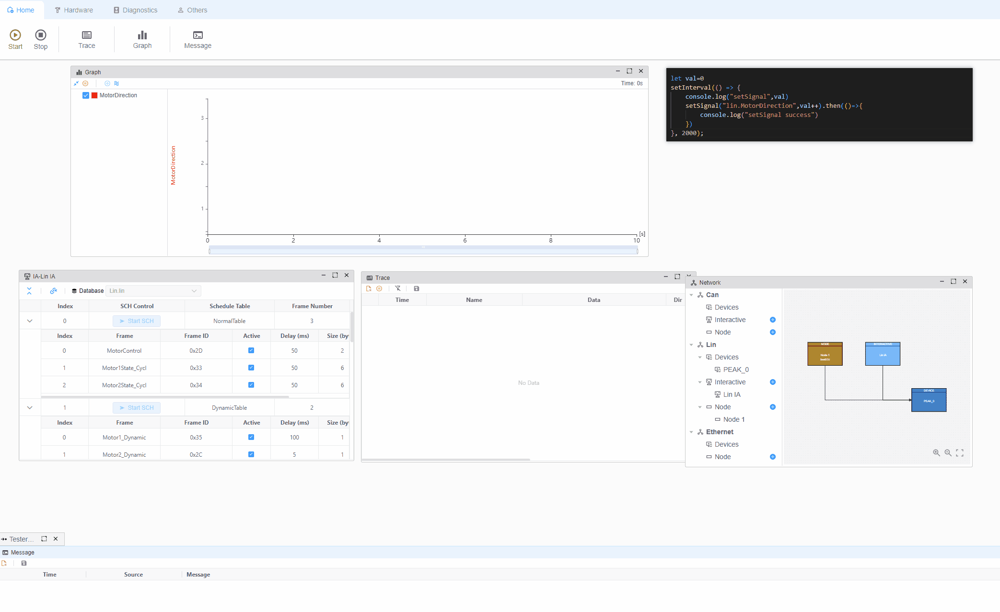

  

  <h1>EcuBus-Pro</h1>

   

    
    
    
  

  <b style="font-size:16px">A powerful automotive ECU development tool</b> 
  <i>Easy of use, Cross platform, Multi dongle, Powerful script ability, CLI support</i> 
  Document: <a href="https://app.whyengineer.com">https://app.whyengineer.com</a>

## Introduction

EcuBus-Pro is a free and open source alternative to `CAN-OE`, designed for automotive ECU development. Our tool offers:

* 🆓 Open source and free
* 🚀 Intuitive user interface
* 💻 Cross-platform compatibility
* 🔌 Multi-vendor USB dongle support (PEAK, Kvaser, ZLG, etc.)
* 📝 TypeScript-based scripting capabilities
* ⌨️ Comprehensive CLI support

### Key Features

See our [User Manual](./docs/um/concept.md) for detailed documentation.

#### Hardware Support

| Vendor | Supported Protocols |
|--------|-------------------|
| PEAK | CAN CAN-FD LIN |
| KVASER | CAN CAN-FD |
| ZLG | CAN CAN-FD |
| Toomoss | CAN CAN-FD (Coming Soon) |

#### Software Features

| Feature | Capabilities |
|---------|-------------|
| Platform Support | Windows (exe,portable) Linux (deb) |
| UDS | CAN/CAN-FD DoIP LIN |
| Scripting | see [Scripting](./docs/um/script.md) |
| Database | LIN LDF (edit and export), CAN DBC (view only), see [Database](./docs/um/database.md) |
| Graph | Signal Graph |

### Visual Overview

#### CAN

#### UDS

#### Graph Signal

### Script Capabilities
Our script engine leverages `Node.js`, enabling you to:
- Use standard Node.js functions
- Access EcuBus-Pro's extensive API
- Automate testing and diagnostics

### Command Line Interface
Streamline your workflow with CLI support for UDS sequences:

## Support this project

Support this project by [becoming a sponsor](./docs/about/sponsor). Your logo will show up here with a link to your website. 🙏

### Technical support

You can also consider sponsoring us to get extra technical support services. If you do, you can get access to the [ecubus/technical-support](https://github.com/ecubus/technical-support) repository, which has the following benefits:

- [X] Handling Issues with higher priority
- [X] One-to-one technical consulting service
- [X] Help to write addon code to access 0x27,0x29 dll functions

## Thanks

This project exists thanks to all the people who have contributed:

Your contributions are always welcome! Please have a look at the [contribution guidelines](./.github/contributing.md) first.

Your logo will show up here.

## License
Apache-2.0

---

