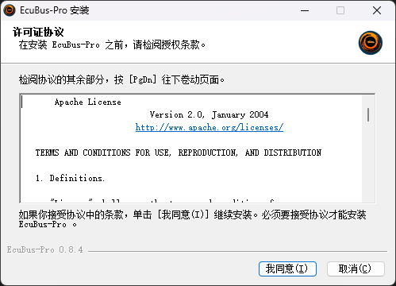
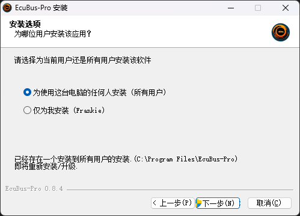
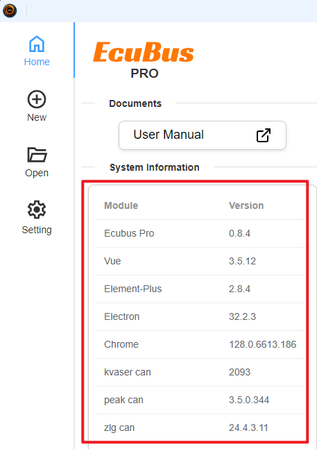

# Install

You can download the latest version of `EcuBus-Pro` from the [github releases page](https://github.com/ecubus/EcuBus-Pro/releases)
Or from our CDN page if you are in 中国❤️:<CustomComponent/>
> [!TIP]
> Right now we only support Windows version of EcuBus-Pro, we will support Linux version in the future.

> [!TIP]
> The minimum version of Windows is Windows 10, but we recommend Windows 11.

## Windows Install Guide

### You can decide for everyone or just for yourself

### You can see the detail information when open the `EcuBus-Pro`

