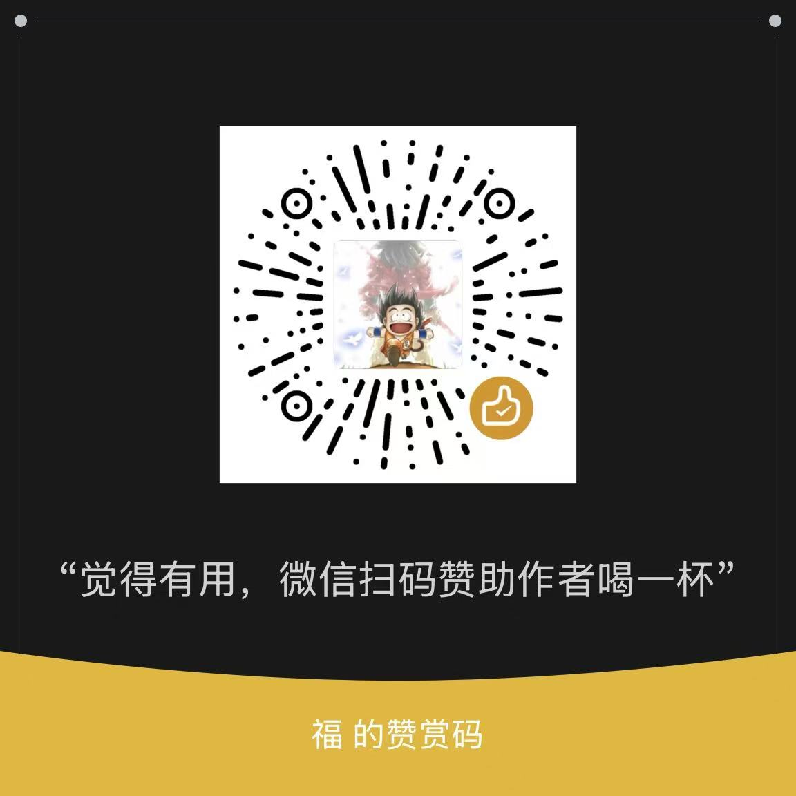

# Sponsoring

The `EcuBus-Pro` projects are personal open-source projects, their development need your help.

If you would like to support the development of `EcuBus-Pro`, you are encouraged to donate!

Feel free to contact us for more details on sponsorship.

[Contact us](./contact.md)

## Payment Methods

### Github Sponsor

<iframe src="https://github.com/sponsors/frankie-zeng/card" title="Sponsor frankie-zeng" height="225" width="600" style="border: 0;"></iframe>

### Paypal

[Become a sponsor](https://paypal.me/zengfrankie)

### OpenCollective

[Become a sponsor](https://opencollective.com/ecubus)

### WeChat

{width=200px}

### Alipay

{width=200px}

## Sponsor tiers

### $5 a month

☕️ - Buy me a coffee every month.

You will receive a Sponsor badge on your profile!

### $10 a month

🙏 - Thank you so much! For sponsoring me you'll receive:

All previous tier rewards
Membership in Discord channel is marked as sponsor
Add your name to the backers section on my personal website

### $20 a month

🍨 - Thank you so much! For sponsoring me you'll receive:

All previous tier rewards
Handling Issues with higher priority

### $50 a month

🐹 - Thank you so much! For sponsoring me you'll receive:

All previous tier rewards
Review your script and provide suggestions for improvement

### $200 a month

🐴 - Thank you so much! That's a lot of money. For sponsoring me you'll receive:

All previous tier rewards
Add a logo and link to the README.md of my major open source projects
One-to-one technical consulting service, see Technical Support

### $500 a month

🐬 - Should you really be spending this much? For sponsoring me you'll receive:

All previous tier rewards
Add a large logo and link to the websites of my major open source projects

### $1000 a month

❤️ - How do you have this much money to spend? For sponsoring me on this incredible tier, you'll receive:

All previous tier rewards
Please contact me to discuss what you want for this tier!

---

## Supporters

| Date | Supporter | Method | Amount | Comment |
| --- | --- | --- | --- | --- |
| 2025-03-25 | 胖胖的风笛 | WeChat | ¥20 | 一杯coffee |
| 2025-05-06 | **刚 | AliPay | ¥9.9 | 感谢作者开源 |
| 2025-05-14 | 悦动思行 | WeChat | ¥20 | 请楼主一杯奶茶 |
