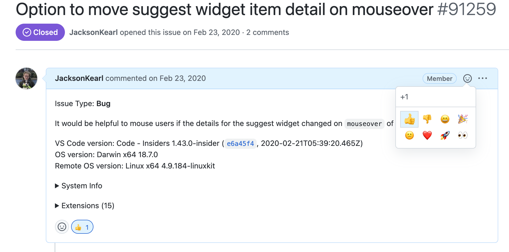

# Feature Request Process

## Steps

1. Create a feature request issue in the GitHub repository.
2. Clearly describe the feature you want to add, including its purpose and how it will benefit users.
3. Label the issue with `enhancement` to categorize it appropriately.

To ensure we prioritize features that benefit the community, new feature requests need at least 5 GitHub reactions (👍) before being considered for our backlog.

## How to Up-vote
Add a 👍 reaction to the feature request issue.

## Process
1. Create a feature request issue
2. Community members up-vote with 👍
3. With 5+ reactions, the feature will be reviewed for backlog
4. Features without enough reactions may be closed