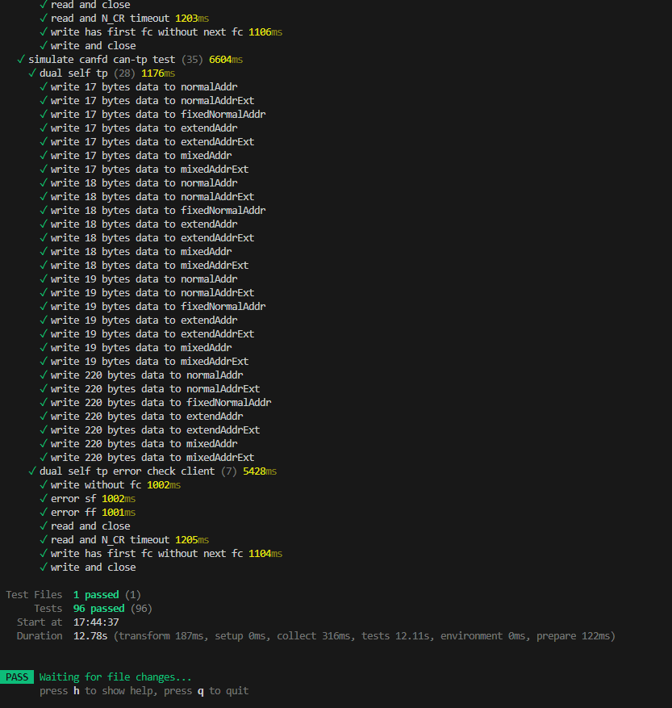

# Test

The test of the project is based on the `Vitest` framework. Get more information about the `Vitest` framework [here](https://vitest.dev/).


## Test Code
All test code is located in the `test` directory. The test code is written in `TypeScript` and uses the `Vitest` framework to run the test.

## Run Test
To run the test, you can use the following command:

```bash
npm run test
```


Stop test when failed
```bash
npx vitest --bail=1
```