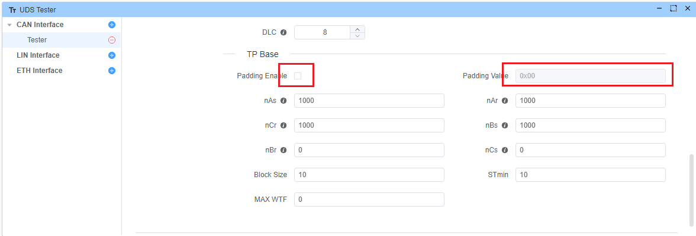

# FAQ
::: details Q: How to configure UDS message length to 8 bytes? {open}

A: You can enable padding by going to UDS Tester -> Tp Base -> Padding Enable. You can also set your own Padding Value, which defaults to 0x00.

:::

