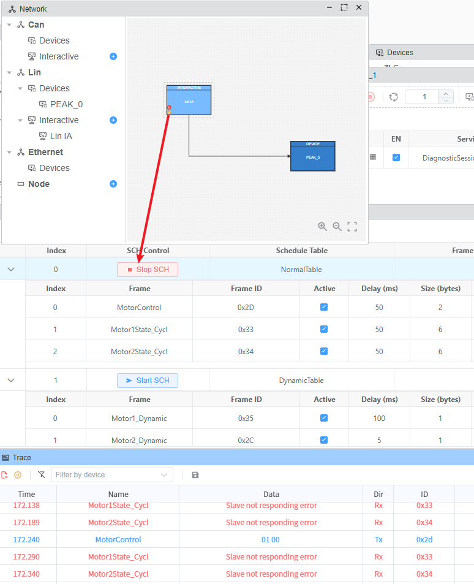
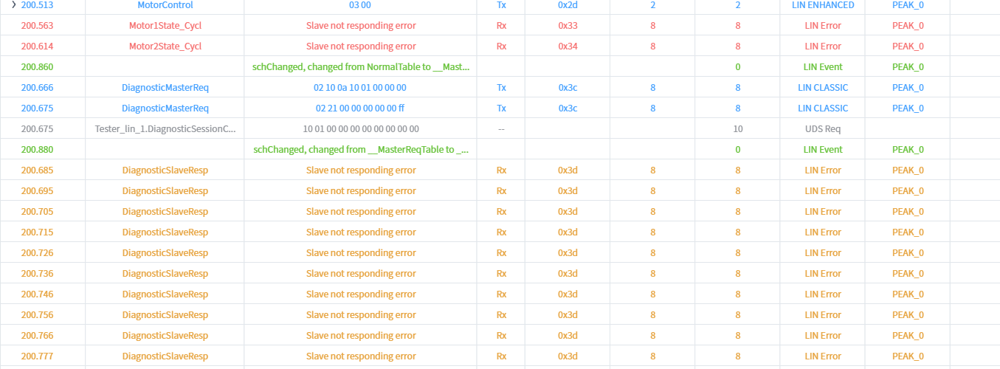

# FAQ
::: details Q: How to configure UDS message length to 8 bytes? {open}

A: You can enable padding by going to UDS Tester -> Tp Base -> Padding Enable. You can also set your own Padding Value, which defaults to 0x00.

:::

::: details Q: ZLG 打开设备提示 Set baud rate failed? {open}

A: 这是一个已知问题，请将EcuBus-Pro安装在非C盘的其他磁盘分区上即可解决。
:::

::: details Q: When using a sequencer to send UDS services over LIN with ID 0x3C and NAD 0x55, why not send a LIN message with ID 0x3D afterward for the slave to respond? {open}

A: This is due to the implementation of the lin schedule table. You should start any schedule table first.

Then you can send the LIN message with ID 0x3D.

:::