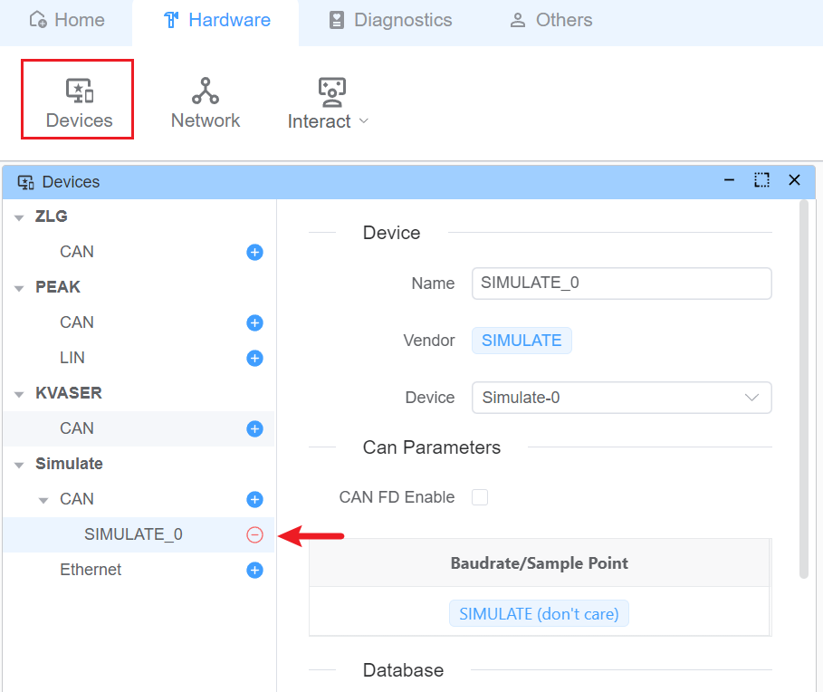
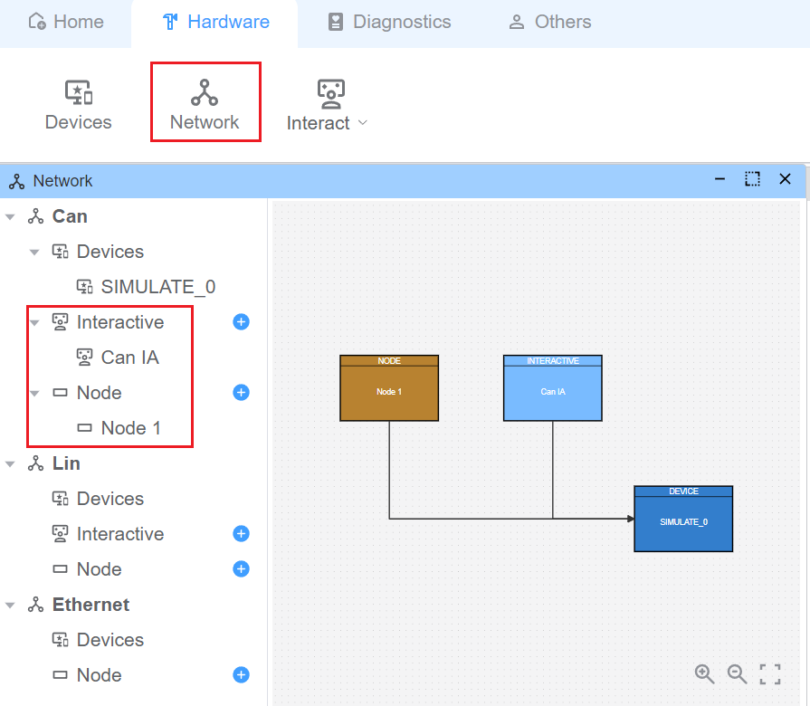
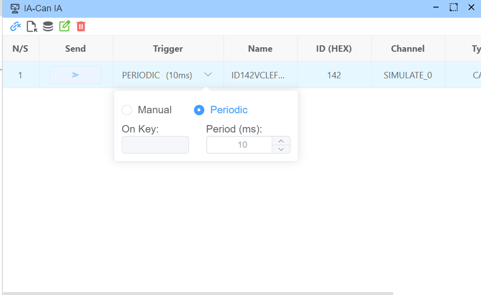
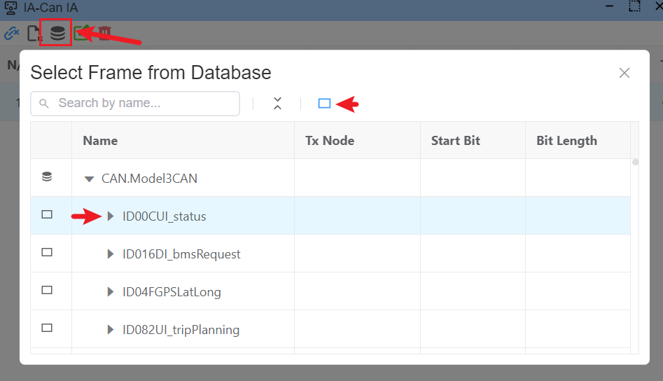
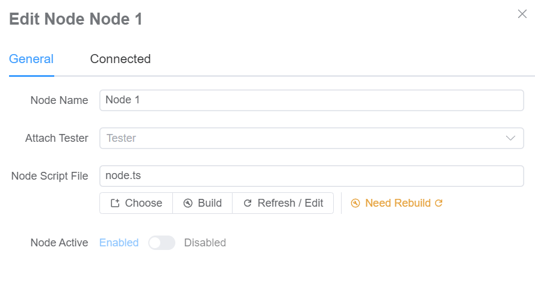
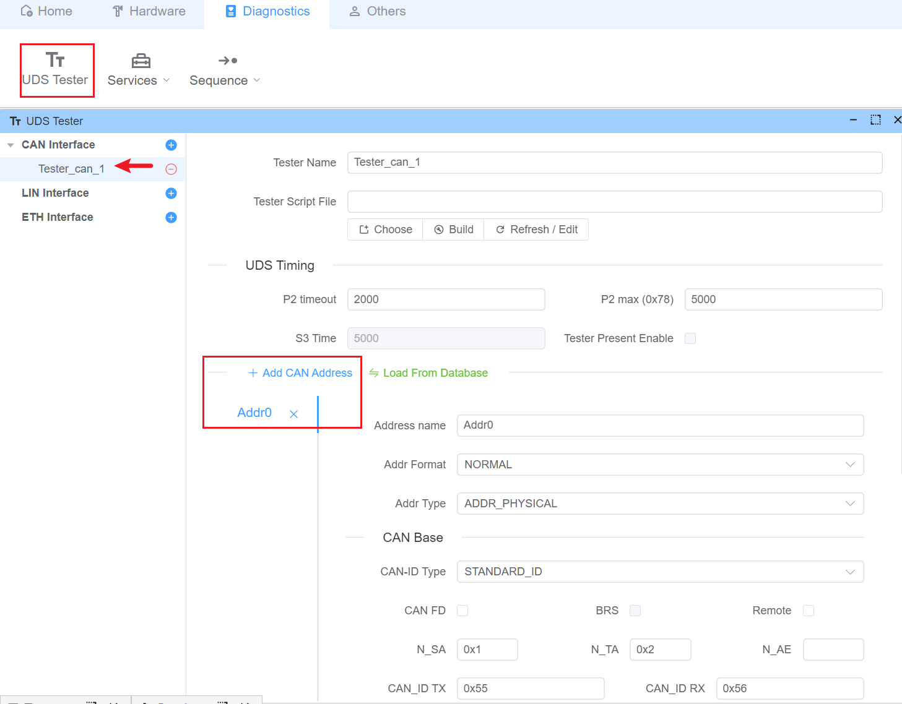
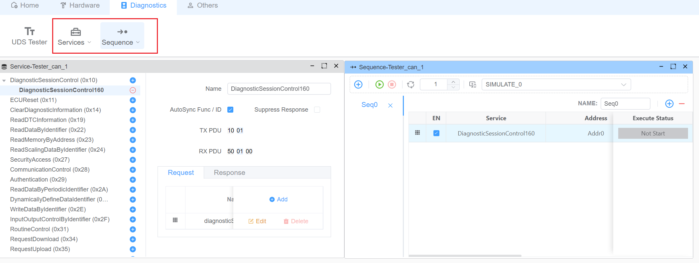
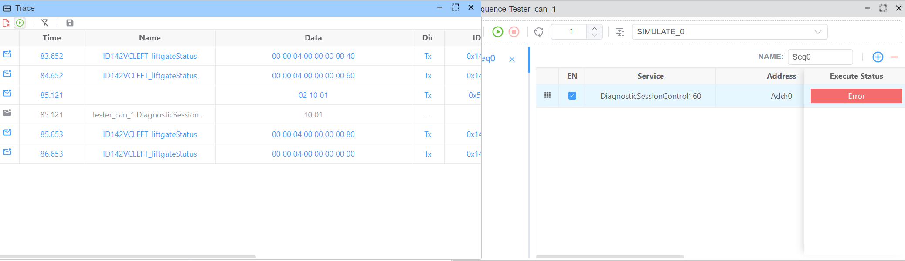

# CAN

CAN/CAN-FD is an industry-standard vehicle bus protocol designed for reliable ECU communication in automotive applications.

> [!IMPORTANT]
> All features described in this section require a CAN DBC file. For more information about DBC files, please refer to our [database documentation](../dbc).

> [!NOTE]
> Supported Hardware:
> | Manufacturer | Protocols |
> |--------|-------------------|
> | PEAK | CAN, CAN-FD |
> | KVASER | CAN, CAN-FD |
> | ZLG | CAN, CAN-FD |
> | Toomoss | CAN, CAN-FD (Coming Soon) |

## Device Configuration

For demonstration purposes, we'll use a simulated device. You can configure the baud rate and sample point in the device settings.



## Interactive Mode and Node Scripts

EcuBus-Pro offers two primary methods for CAN communication:

- Interactive Mode: For manual frame transmission
- Node Scripts: For automated communication using custom scripts



### Interactive Mode

Each frame can be configured for periodic transmission or manual triggering (single-shot or key-bound).


You can add frames in two ways:

- Manual frame configuration
- Import from DBC database
  

### Node Scripts

Nodes can be configured with UDS capabilities (tester) and custom scripts.


Example script for periodic signal updates:

```typescript
import { setSignal } from 'ECB'
let val = 0
// Update signal value every second
setInterval(() => {
  setSignal('Model3CAN.VCLEFT_liftgateLatchRequest', val++ % 5)
}, 1000)
```

## Diagnostic Operations

1. **Tester Configuration**

   - Configure addressing
   - Set diagnostic parameters
     

2. **Diagnostic Services**

   - Configure diagnostic services
   - Create schedule tables and sequences
     

3. **Message Monitoring**
   - View transmitted and received messages in the trace window
     
