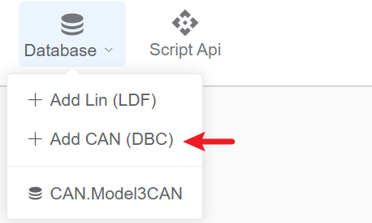
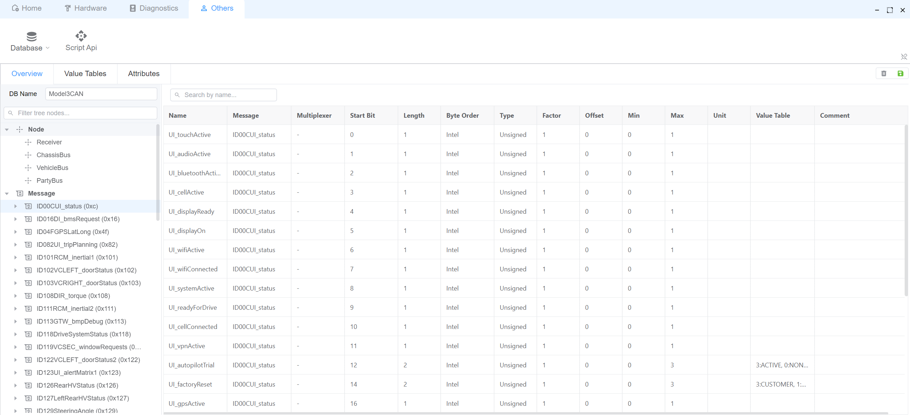
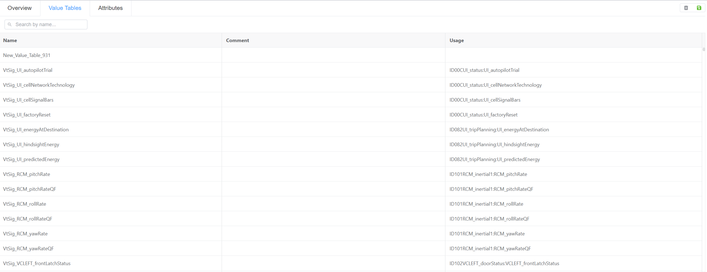
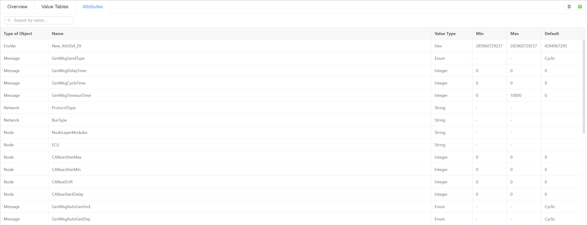

# CAN DBC

EcuBus-Pro supports parsing most CAN DBC files. If you encounter any DBC files that cannot be parsed correctly, please report the issue on our [Github Issues](https://github.com/ecubus/EcuBus-Pro/issues) page.

The application provides an efficient search interface for messages and signals.

> [!NOTE]
> Currently, EcuBus-Pro only supports viewing DBC files and does not support editing. Please ensure your DBC file is correctly formatted before use.

## Select a DBC File

## Overview
The DBC viewer provides comprehensive information about:
* Network Nodes
* Messages
* Signals

## Value Tables
Value tables define the mapping between raw values and their corresponding meanings.

## Attributes
View and inspect all DBC attributes.

