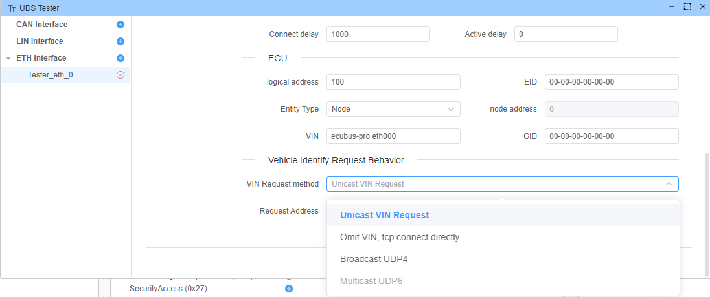
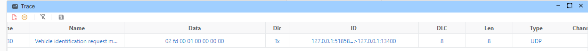
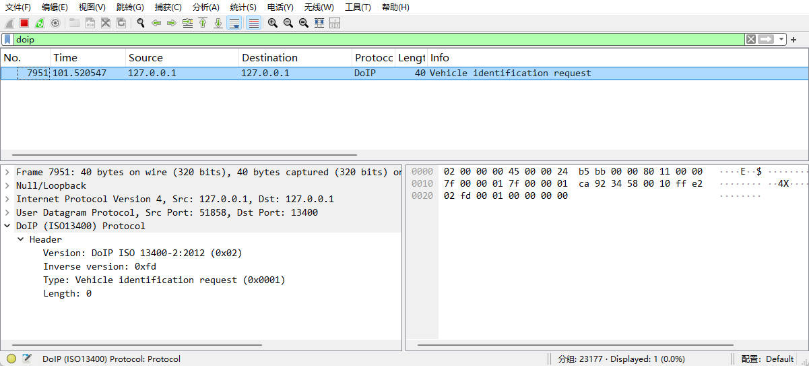
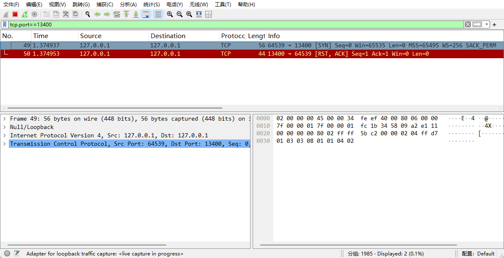
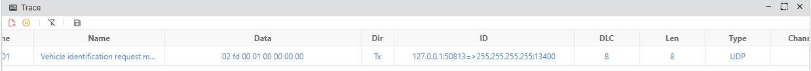
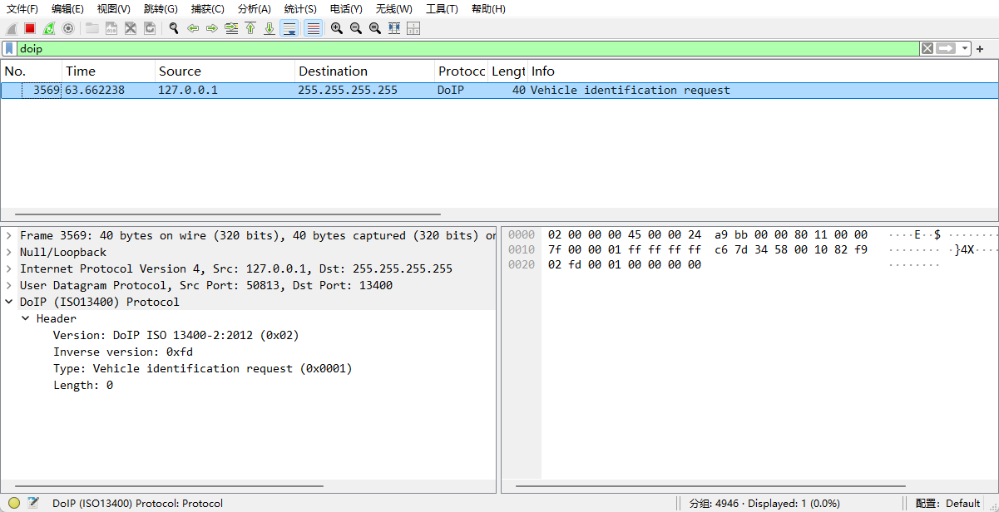

# Vehicle Identification Request Behavior

we support 4 VIN request methods:

1. Unicast VIN Request
2. Omit VIN, tcp connect directly
3. Broadcast VIN Request (UDP4)
4. Multicast VIN Request (UDP6)

## Unicast VIN Request

> [!NOTE]
> This method is only setup Request Address.
>

## Omit VIN, tcp connect directly

without UDP request, connect directly to the tcp server, see [[#82](https://github.com/ecubus/EcuBus-Pro/issues/82)]

> [!NOTE]
> This method is only setup Request Address.
>

## Broadcast VIN Request (UDP4)

## Multicast VIN Request (UDP6)

unsupported yet.

