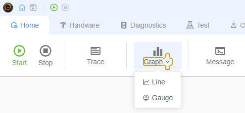
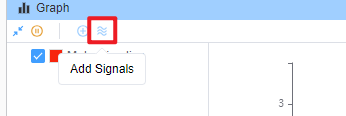
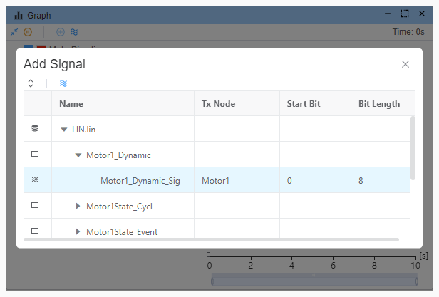
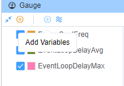
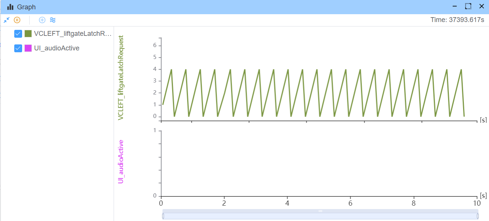
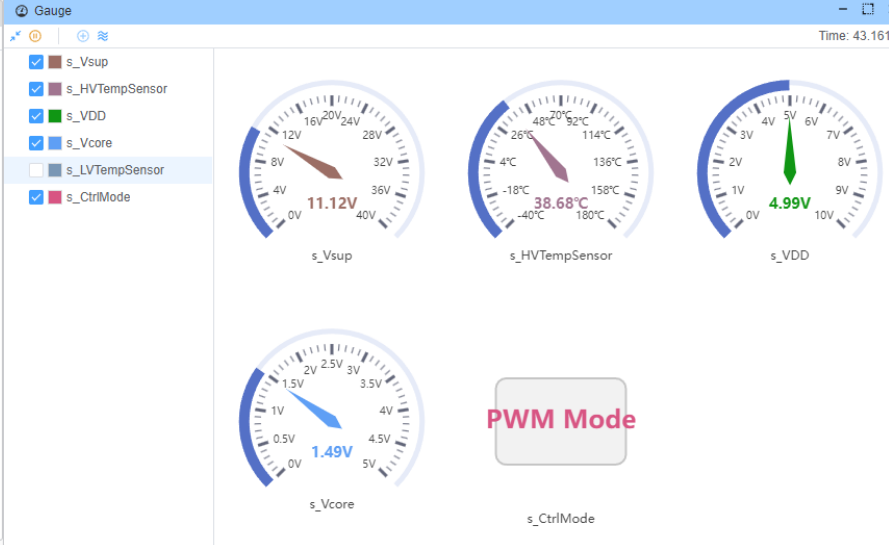
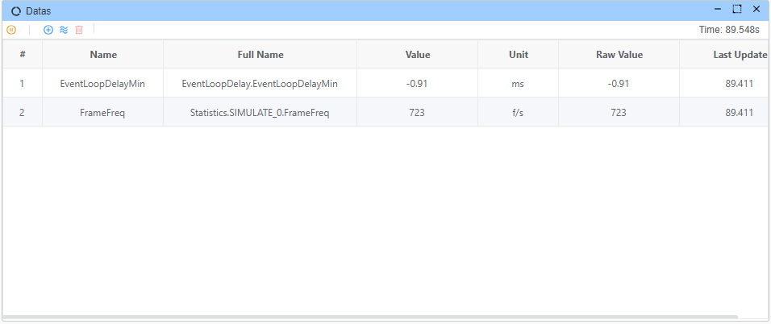
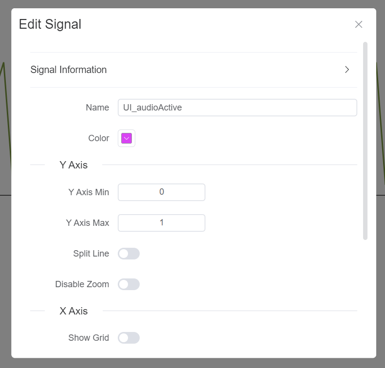
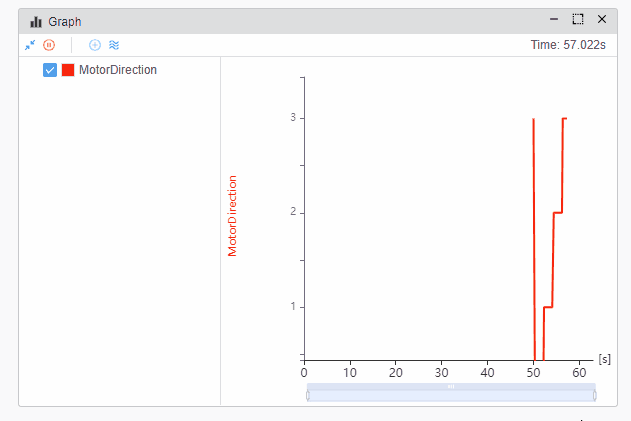

# Graph

The graph signal feature allows you to visualize the data flow between signals in a graphical format. This feature is especially useful for understanding the relationship between signals and for debugging complex signal interactions.

* **Line**
* **Gauge** 
* **Data**

## Adding Signals

Add signal from database, which depends on [database](./../database.md).

## Add Variabls

All valid variables from [`Variable Window`](./../var/var.md).

## Multi Signal In One Graph

## Edit Signal Property

## Drag/Zoom Line Graph

You you zoom in/out the graph by dragging the mouse wheel.

