# LIN LDF

The LDF parser supports the following LIN Specification versions:

- 2.2
- 2.1
- 2.0

## Selecting an LDF File

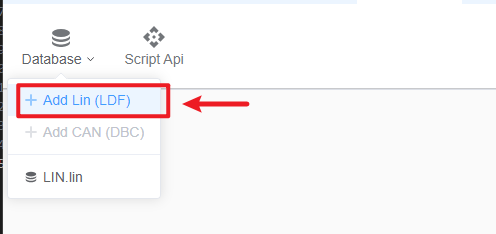

## Saving the Database

When creating a new database, you must assign a unique name and save it.
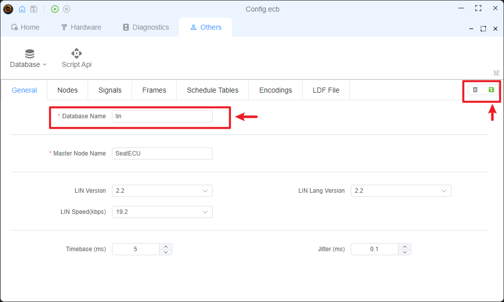

## LDF Editor

You can edit the LDF database through different tabs. Each section implements strict error checking to ensure data integrity.

### General

This tab displays general database information and error notifications. All errors must be resolved before saving or using the database.
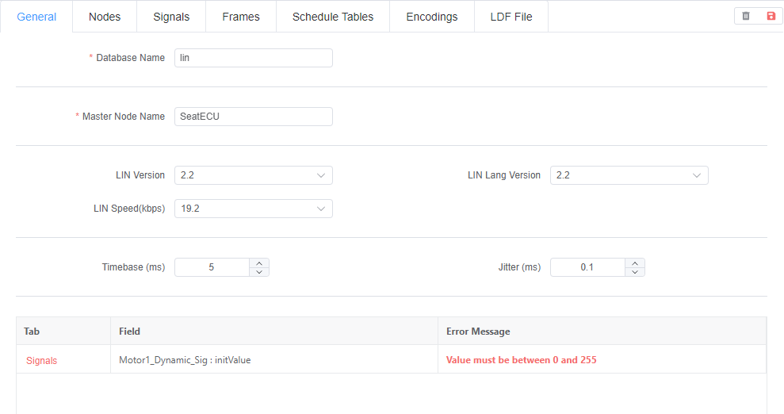

### Nodes

Configure slave node attributes in this section. Strict error checking is implemented to validate node configurations.
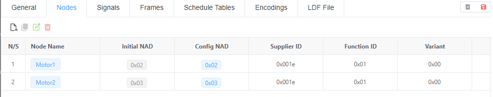
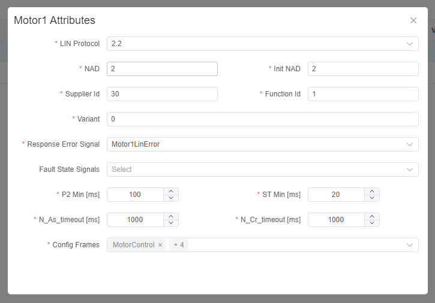

### Signals

Manage signal information in this tab. Erroneous signals will be highlighted. All signal configurations undergo strict validation.
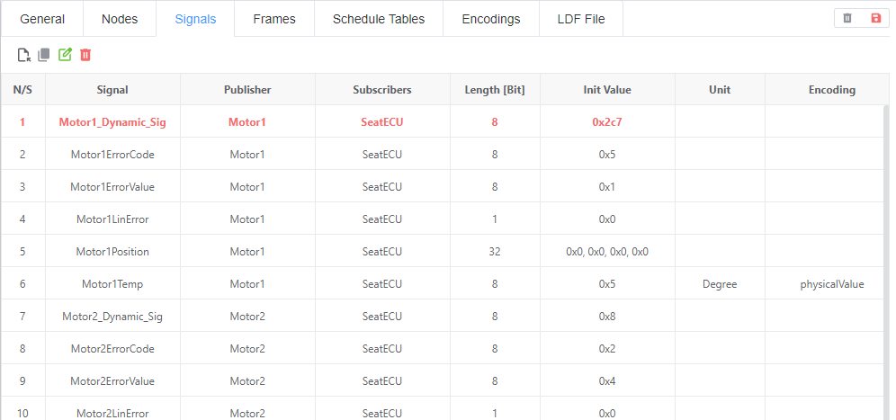
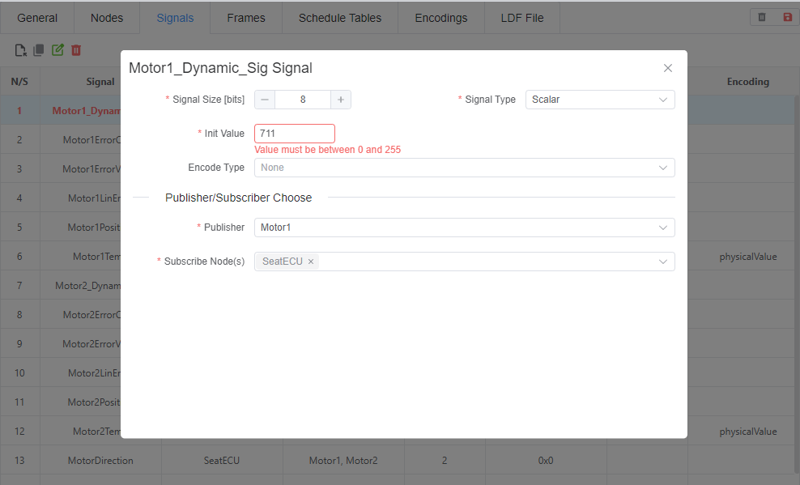

### Frames

This section shows Unconditional frames only. Other frame types can be configured in the Schedule table. Erroneous frames will be highlighted. Strict error checking ensures frame integrity.
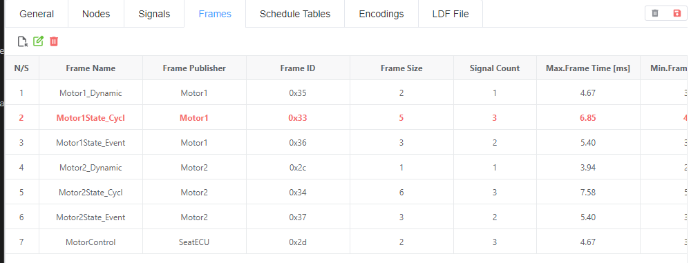
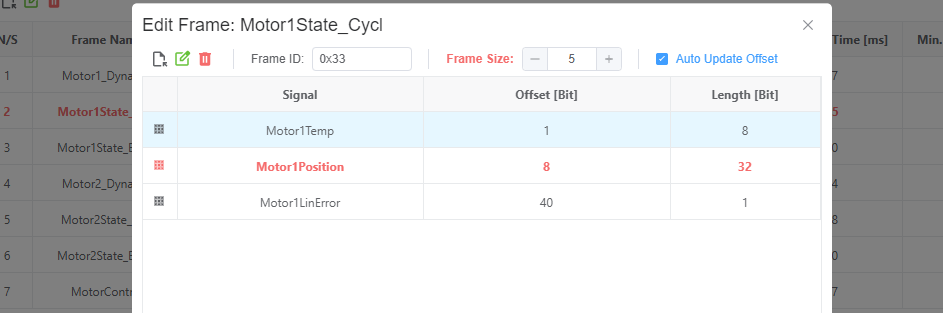

### Schedule

Configure schedule tables and add frames to them in this section. All schedule configurations are strictly validated.
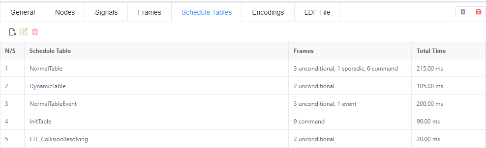
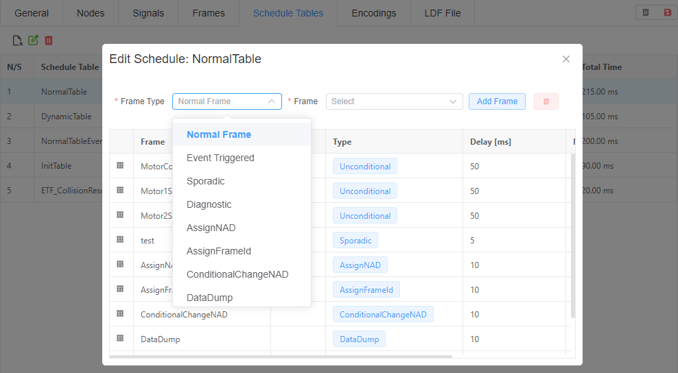

### Encode

Define encoding information here. Signal encoding can be edited in the Signals tab after configuration. Strict validation is performed on all encoding definitions.
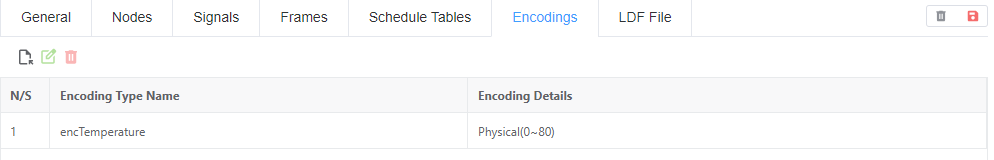
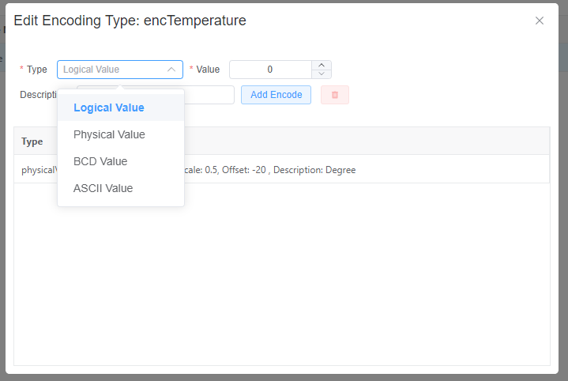

### LDF

View the real-time LDF file content. You can copy the LDF content from here once all errors are resolved.
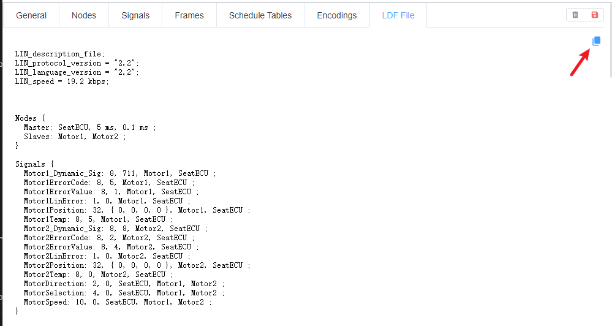
