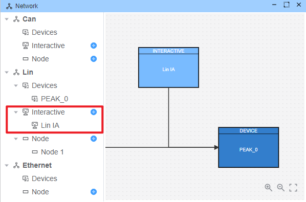
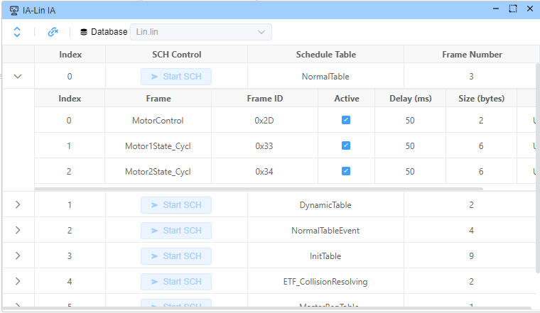
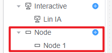
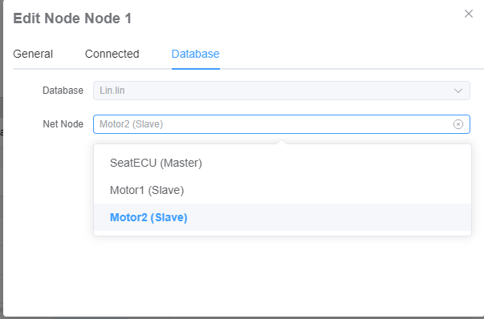
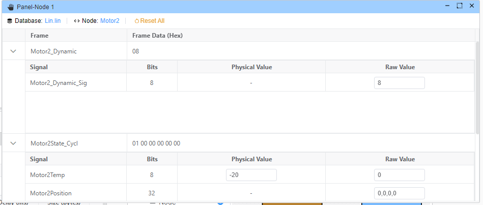
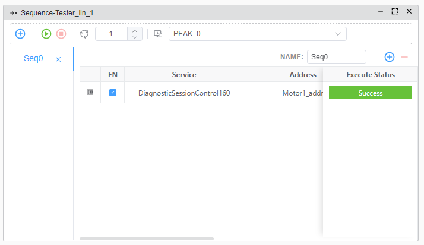
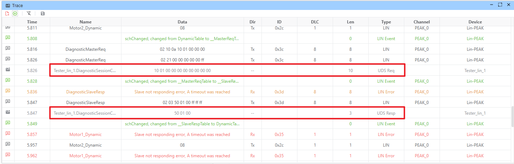

# LIN (Local Interconnect Network)

LIN is a cost-effective and deterministic communication protocol designed for connecting Electronic Control Units (ECUs) with smart sensors, actuators, and controls. EcuBus-Pro's LIN module provides comprehensive features for developing, analyzing, and testing LIN networks in compliance with LIN 2.x specifications.

> [!IMPORTANT]
> All features described below require importing a LIN Description File (LDF). For more information about LDF, see the [database documentation](./../ldf).

> [!NOTE]
> Only support PEAK

## Schedule Table Management

Control and monitor LIN network communications through schedule table execution.

### Schedule Table Operations

1. **Add Interaction**
   - Access the schedule table configuration interface
   - Define communication parameters
   

2. **Open Interaction**
   - View and manage existing schedule tables
   

## Node Simulation & Signal Editing

Configure and simulate LIN nodes to test network behavior.

### Node Configuration Steps

1. **Add Node**
   - Create a new node in the network
   

2. **Configure Node Settings**
   - Set up node parameters and properties
   

3. **Signal Value Editor**
   - Edit signal values for configured nodes
   - Note: Only signals published by the configured node can be modified
   

## LIN Transport Protocol and Diagnostics

Implement and test diagnostic services using LIN TP.

### Diagnostic Operations

1. **Configure LIN Tester**
   - Import address information from LIN database
   - Set up diagnostic parameters
   

2. **Diagnostic Execution**
   - Enable schedule table execution (required for diagnostics)
   - Send diagnostic requests and monitor responses
   
   
   Response handling:
   - View diagnostic responses from simulated nodes
   
