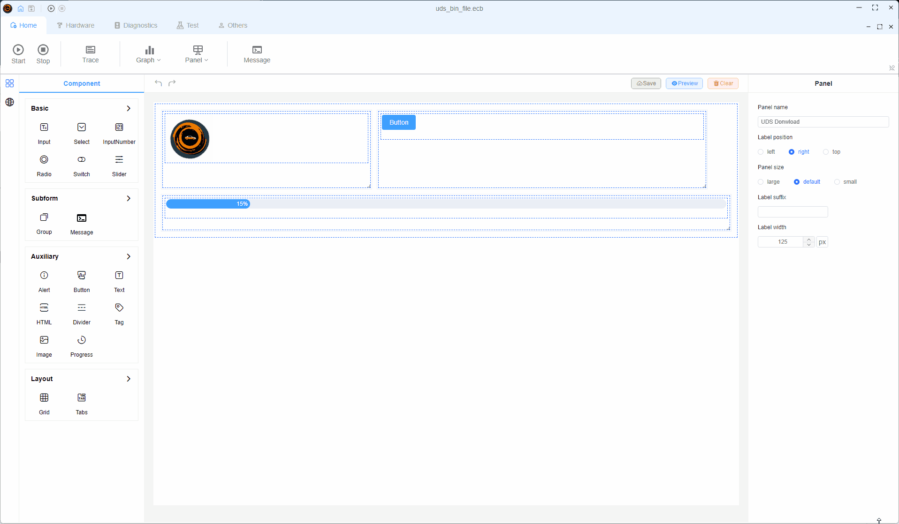
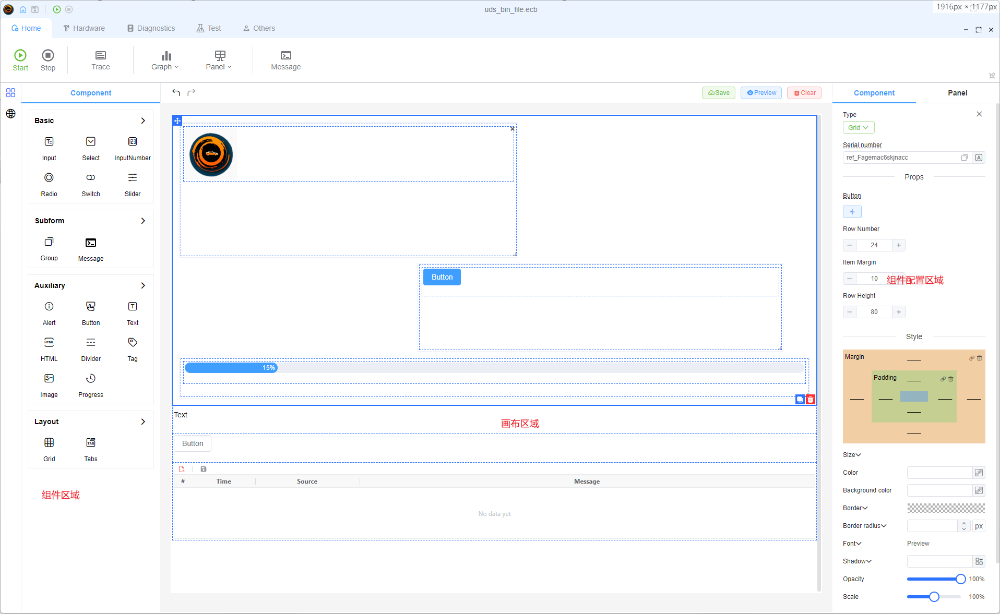
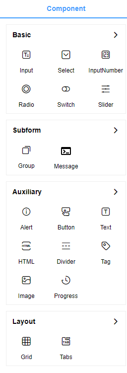
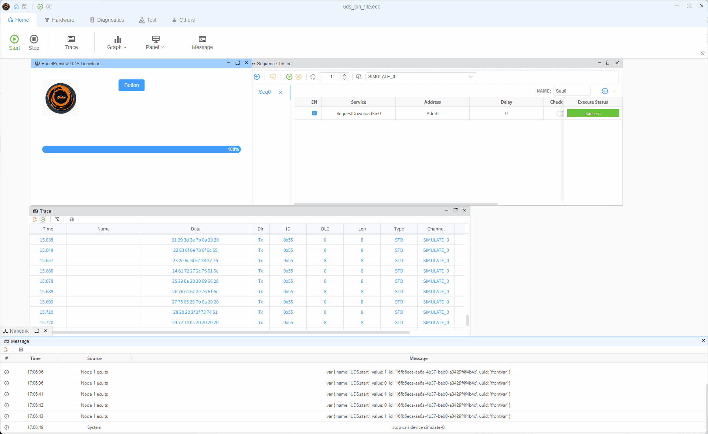

# Panel

## What is Panel?

The Panel is a flexible, drag-and-drop interface that provides a blank slate where you can freely arrange and connect functional components. Like building with LEGO blocks, you can assemble various features within the Panel to create custom interfaces:

## Panel Capabilities

The Panel feature offers exceptional flexibility for quickly building various demonstrations or testing platforms:

- Create conversion tools with graphical interfaces for users
- Build testing pipelines with simple, click-based interfaces for production line workers
- Connect components to DBC/LDF file signals, enabling UI changes to trigger corresponding signal changes, see [Database](./../database)
- Bind components to user-defined or system variables to display or modify their values, see [Variable](./../var/var)
- And much more to be discovered!

## Panel Features

### Editing Functionality

The editing interface consists of three main areas:

1. **Component Area**: Contains a wide range of ready-to-use components
2. **Panel Area**: For placing and arranging components
3. **Component Property Editor**: For setting component properties such as signal binding, variable binding, etc.

### Supported Components

The Canvas currently supports four major categories of components:

- **Interactive Components**: Buttons, inputs, and other user interaction elements
- **SubForm Components**: Special functionality components
- **Display Components**: Visual representation elements
- **Layout Components**: For organizing and structuring your interface

More component types will be added in future updates, such as dashboard gauges to simulate a car instrument panel.

### Display Functionality

After configuring your components, users can view and interact with them in the display mode:

