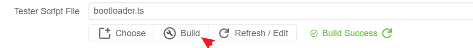
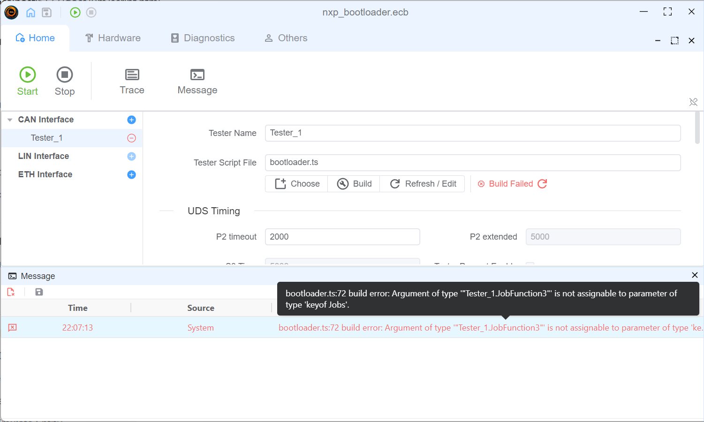
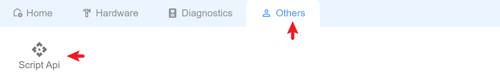

# Script

The script based on TypeScript/JavaScript in node.js environment. we use `ts` to do syntax check and use esbuild to build the script, the build script is in the `.ScriptBuild` folder.

## Editor

Vscode is recommended to edit the script, you can install the `TypeScript` extension to get the syntax check and intellisense.


> [!TIP]
> We also plan to provide a vscode extension to let you build the script in vscode directly.

## Build Script

you can get the build error info in `Message` window if there is any error in the script.


## Script API
You can open the `API` window to get the API info.


## Script Usage

### Node.js Ability

#### Init
Init function is the entry of the script, it will be called when the script is loaded.

```typescript
Util.Init(()=>{
    console.log('Init');
})
```

#### Timer

Timer is node.js built-in feature, you can use it to do some periodical work. more details about the timer, please refer to [Timer](https://nodejs.org/api/timers.html)

```typescript
// periodical output can message
let timer = setInterval(() => {
    outputCan(canMsg);
}, 1000);

// stop the timer
clearInterval(timer);

//refresh the timer
timer.refresh();
```

#### OnKey

listen to the key event, you can use it to do some work when the key is pressed.

```typescript
// listen to the key event
Util.OnKey('s', () => {
    outputCan(canMsg);
});

```

#### OnCan

listen to the can message, you can use it to do some work when the can message is received.

```typescript
// listen to the can message
Util.OnCan(0x1, (msg) => {
    console.log(msg);
});
// listen all can message
Util.OnCan(true, (msg) => {
    console.log(msg);
});

```

#### On
listen to the uds message.
`<tester name>.<service item name>.recv` is used to listen to the uds message received.
`<tester name>.<service item name>.send` is used to listen to the uds message send.
```typescript
// listen to the uds message
Util.On('Can.DiagRequest.recv', (msg) => {
   //receive diag response
});
Util.On('Can.DiagRequest.send', (msg) => {
   //receive diag request
});


```
