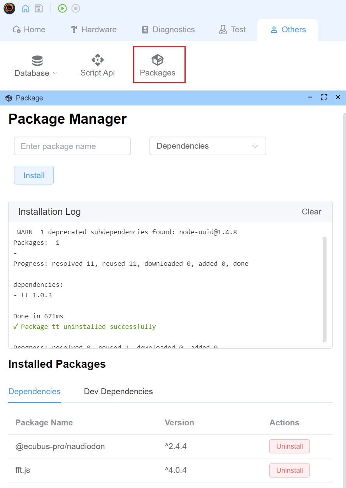

# Use External Packages

Since EcuBus-Pro script is based on Node.js, you can use any Node.js package in your script. There are two ways to install packages:

## Method 1: Using Package Manager Interface

When using a project for the first time, you need to initialize the package.json file before installing packages.

EcuBus-Pro provides a graphical package manager interface for easy installation, management, and uninstallation of packages.

1. For new projects, you'll see a message "No package.json found" and an "Initialize package.json" button. Click this button to create a new package.json file.

2. Click on the "Packages" option in the left navigation bar of the main interface



3. In the Package Manager interface:
   - Enter the name of the package you want to install
   - Select the installation type (Dependencies or Dev Dependencies)
   - Click the "Install" button

4. You can view and manage installed packages in the "Installed Packages" section at the bottom

## Method 2: Using EcuBus-Pro CLI

You can also install packages using the `pnpm` command in the EcuBus-Pro CLI. See [EcuBus-Pro CLI](cli.md) for more details.

### Install via CLI

Install the `serialport` package in your project root directory.

```bash
ecb_cli pnpm install serialport
```


## Usage Example

Here is an example of how to use the `serialport` package in your script.
For more information about the `serialport` package, please refer to the [serialport website](https://serialport.io/).

### Code Example

```typescript
import { SerialPort } from 'serialport'
//open port with path and baudrate
const port = new SerialPort({
  path: 'COM9',
  baudRate: 57600,
  autoOpen: true
})
//get port list
SerialPort.list()
  .then((ports) => {
    console.log(ports)
  })
  .catch((err) => {
    console.error(err)
  })
```

### Running Result


