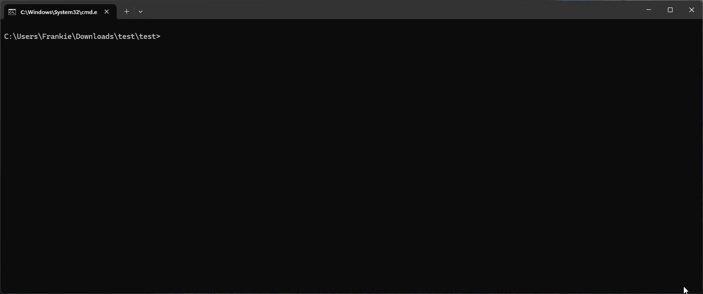
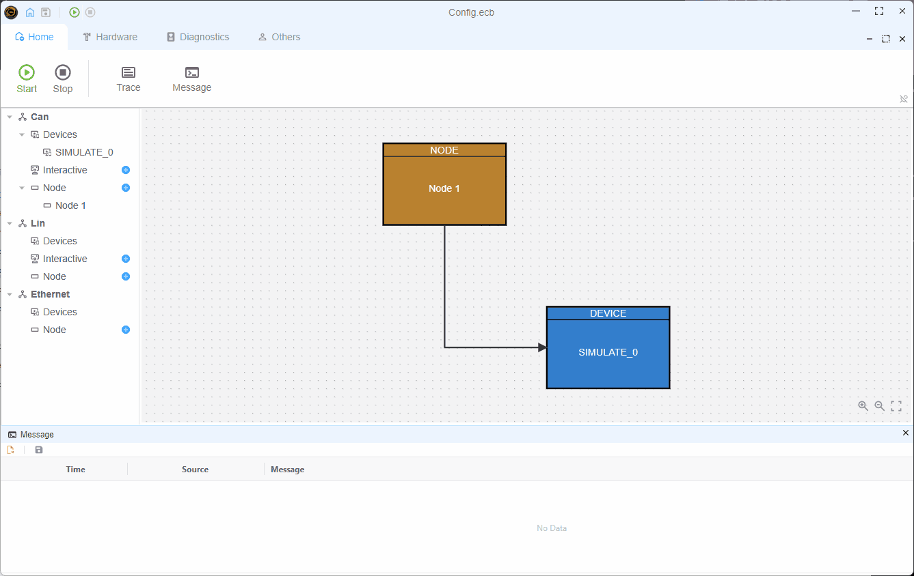

# Use External Packages

Because EcuBus-Pro Script is based on Node.js, you can use any Node.js package in your script. You can install the package using the `pnpm` command in the EcuBus-Pro CLI, see [EcuBus-Pro CLI](cli.md) for more details.


## Example
Here is an example of how to use the `serialport` package in your script.
About the `serialport` package, you can refer to the [serialport](https://serialport.io/) website.


### Install 

Install the `serialport` package in your project root directory.

```bash
ecb_cli pnpm install serialport
```


### Usage

use the `serialport` package in your script.

```typescript
import { SerialPort} from 'serialport'
//open port with path and baudrate
const port = new SerialPort({
  path: 'COM9',
  baudRate: 57600,
  autoOpen: true
})
//get port list
SerialPort.list().then(ports => {
  console.log(ports)
}).catch(err => {
  console.error(err)
})
```

### Run
