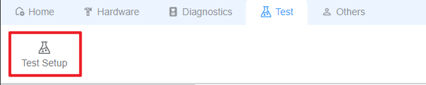
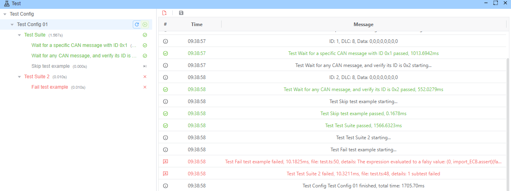
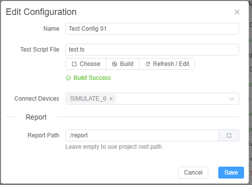
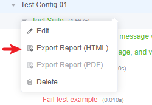
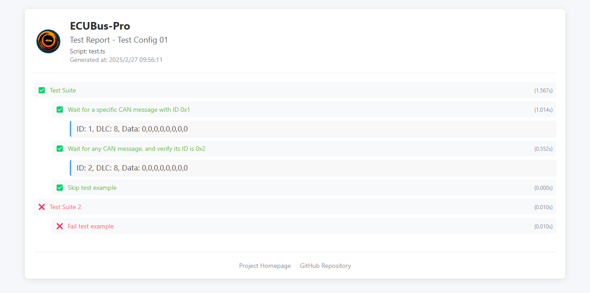

# EcuBus-Pro Testing Architecture

## Overview

EcuBus-Pro provides a powerful and flexible testing framework for automotive ECU development and validation. The testing architecture allows developers to create, execute, and monitor automated tests for Bus communications, ensuring reliable and consistent behavior of automotive systems.



## Key Features

### Config 

Monitor test execution with a user-friendly interface showing real-time results




### TypeScript-Based Test Framework

Write tests using familiar TypeScript syntax with built-in testing utilities. See [Srcipt](./../script.md). 

Reused the node.js [test runner](https://nodejs.org/docs/latest/api/test.html)

#### Example

```typescript
 describe('Test Suite', () => {


  test('Wait for a specific CAN message with ID 0x1', async () => {
    await TestWaitForMessage(0x1, 3000)
    assert(true)
  })

  // Test case that waits for any CAN message and verifies its ID is 0x2
  test('Wait for any CAN message, and verify its ID is 0x2', async () => {
    const msg = await TestWaitForMessage(true, 3000)
    assert(msg.id == 0x2)
  })

  // Skipped test case that would otherwise pass immediately
  test.skip('Skip test example', async () => {
    assert(true)
  })
})

// Second test suite
describe('Test Suite 2', () => {
  // Simple test case that passes immediately
  test('Fail test example', () => {
    assert(false)
  })
})
```

### Detailed Test Reports 

Generate comprehensive test reports with timing and pass/fail information





