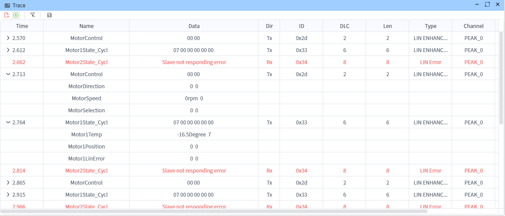
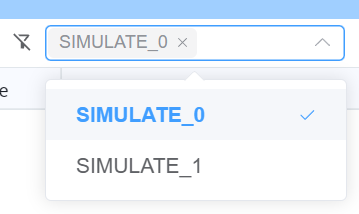
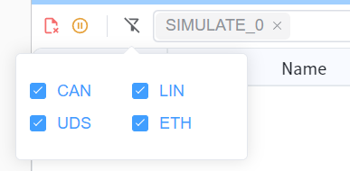
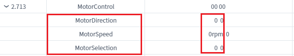
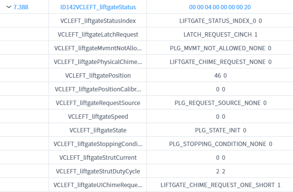

# Trace 

The Trace window provides an interface for viewing and exporting data. Users can save data through buttons on the toolbar for further analysis or archival purposes.

>[!INFO]
> Currently, Trace has a maximum storage capacity of 50,000 entries. When this limit is exceeded, the oldest data will be automatically deleted.

## Filter

### Filter By Device
The Trace window supports filtering by device, signal name, and signal value.
> [!NOTE]
> Selecting all devices or no devices has the same effect.

## Filter By Message Type

* CAN - Receive CAN-related data
* LIN - Receive LIN-related data
* UDS - Receive UDS-related data
* ETH - Receive Ethernet-related data

## Supported Export Formats

* Excel - Export data in Microsoft Excel format
* ASC (ASCII) - Export data in ASCII format, compatible with various CAN analysis tools
* [Feature Request](./../../dev/feature.md)

## Column Information

The Trace window typically includes the following columns:

- **Timestamp**: Displays the precise time when the event occurred
- **Name**: Represents the frame signal name that triggered the event
- **Signal Value**: Shows the current value of the signal
- **DIR (Direction)**: Indicates the signal direction (Tx for transmit, Rx for receive)
- **ID**: Represents the signal identifier
- **DLC (Data Length Code)**: Shows the data length code
- **LEN (Length)**: Displays the actual data length
- **Type**: Indicates the signal type (e.g., boolean, integer, float)
- **Channel**: Shows the communication channel number
- **Device**: Displays the device name

When the corresponding hardware channel is bound to a [database](../database.md), these column information helps users quickly understand and analyze the system's operating state.

>[!INFO]
> Signal values within frames can only be viewed when the Trace window is paused

## LIN Signal Display

## CAN Signal Display

