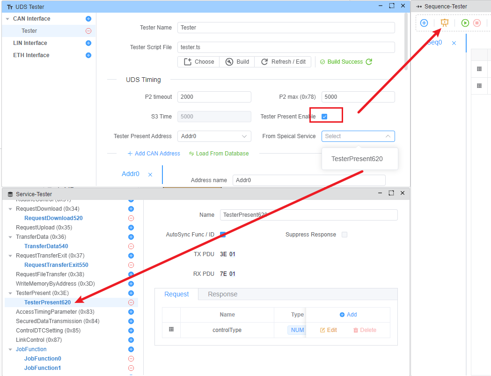

# Tester Present

Tester Present (Service ID 0x3E) is a diagnostic service used to indicate to an ECU that a diagnostic client (tester) is still present and the diagnostic session should remain active.

The main purposes of Tester Present are:

- Keep a non-default diagnostic session active by periodically sending messages
- Prevent timeout of the diagnostic session (S3 timeout)
- Maintain communication between tester and ECU

> [!NOTE]
> Tester Present only support CAN right now.

## Configuration

In EcuBus-Pro, Tester Present can be configured in the `UDS Tester` window:

### S3 Time [M]

S3 Time means S3 Client timeout, it is the maximum time between Tester Present messages.

### Tester Present Address [M]

The address of the Tester Present message, it can be set to a physical address or a functional address.

### From Speical Serivce [O]

The default message of Tester Present is `0x3E 0x00`, if you want to use a special service, you can select one from the service list.

