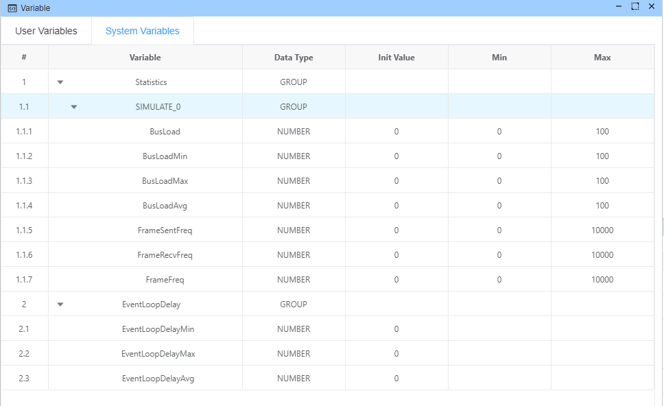
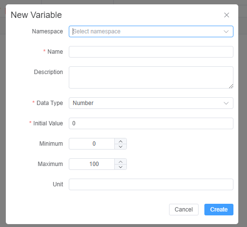
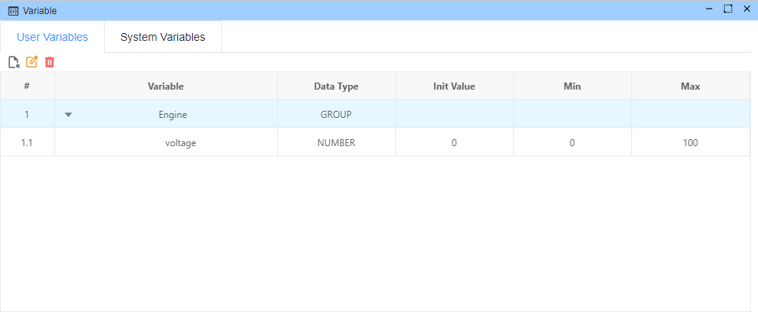

# Variable System

## Overview
The Variable System is a powerful feature that allows users to create, manage, and use dynamic values throughout the Ecubus Pro platform. Variables function like virtual signals flowing through the internal system, carrying information between different components and nodes. These virtual signals can be captured, transformed, and routed to create flexible and interconnected systems where changes in one area can automatically propagate to others.

## Features

* Set/Get variable in [Script](./../script/script.md) or [Detail API](https://app.whyengineer.com/scriptApi/classes/UtilClass.html#onVar)
* Show variable In [Graph](./../graph/graph.md)
* Default System Variable

## System Variables

System variables are pre-defined variables that provide real-time information about the system's performance and connected devices. These variables are automatically updated by the system and can be accessed but not modified directly by users.

### Performance Monitoring Variables

The system provides performance monitoring variables that help track the application's event loop performance:

| Variable ID | Description | Unit |
|-------------|-------------|------|
| `EventLoopDelay.min` | Minimum event loop delay - lower values indicate better performance | ms |
| `EventLoopDelay.max` | Maximum event loop delay - higher values indicate potential performance issues | ms |
| `EventLoopDelay.avg` | Average event loop delay - a good balance between performance and stability | ms |

These variables are essential for monitoring the responsiveness and performance of the application. High event loop delay values may indicate processing bottlenecks that could affect system responsiveness.

### Device Statistics Variables

For each connected CAN device, the system automatically creates a set of statistics variables:

| Variable ID Pattern | Description | Unit |
|---------------------|-------------|------|
| `Statistics.{deviceName}.BusLoad` | Current bus load for the specified device | % |
| `Statistics.{deviceName}.BusLoadMin` | Minimum bus load recorded | % |
| `Statistics.{deviceName}.BusLoadMax` | Maximum bus load recorded | % |
| `Statistics.{deviceName}.BusLoadAvg` | Average bus load | % |
| `Statistics.{deviceName}.FrameSentFreq` | Frequency of frames sent | f/s |
| `Statistics.{deviceName}.FrameRecvFreq` | Frequency of frames received | f/s |
| `Statistics.{deviceName}.FrameFreq` | Overall frame frequency | f/s |

## User Variables

User variables are custom variables that you can create, modify, and delete based on your specific needs. These variables can be used across the application to store values, track states, and create dynamic workflows.

### Supported Data Types

User variables support the following data types:

* **Number**: Numerical values with optional min/max bounds and unit specification
* **String**: Text values for storing names, messages, or any alphanumeric content
* **Array**: Collections of values organized in a list format

### Creating User Variables

To create a new user variable:

1. Navigate to the **User Variables** tab in the Variable Manager
2. Click the "Add Variable" button (file icon)
3. Fill in the variable details:
   - **Namespace**: (Optional) Group your variables logically
   - **Name**: Unique identifier for the variable (letters, numbers, and underscores only)
   - **Description**: (Optional) Additional information about the variable's purpose
   - **Data Type**: Select Number, String, or Array
   - **Initial Value**: The starting value for the variable
   - For Number type:
     - **Minimum**: Optional lower bound
     - **Maximum**: Optional upper bound
     - **Unit**: Optional unit of measurement (e.g., "ms", "°C", "rpm")

