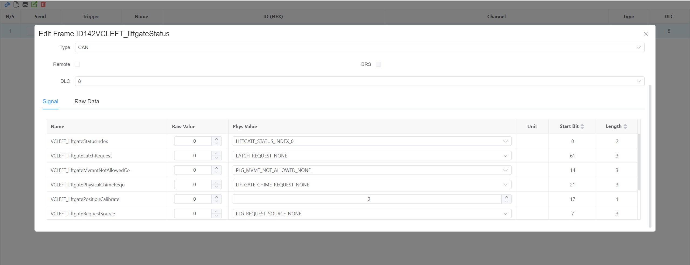
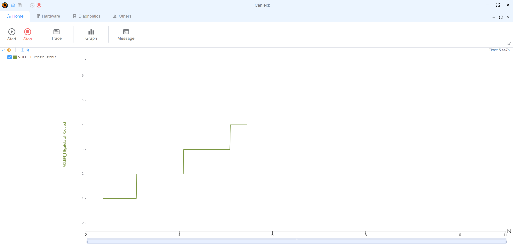

# CAN Example

This example demonstrates basic CAN communication setup and usage in EcuBus-Pro.

## Network Structure

The example consists of three nodes:

- Node 1 (Brown) - Signal generator node
- Can IA (SkyBlue) - Interactive analysis interface
- SIMULATE_0 (Blue) - CAN bus simulator

The nodes are connected in a CAN network topology, with Node 1 sending signals through SIMULATE_0 device, which can be monitored and analyzed in Can IA.

## Features Demonstrated

1. **Message Transmission**

   - Node 1 runs a script that periodically updates signal value
   - Signal: VCLEFT_liftgateLatchRequest (cycles through values 0-4)
   - Update interval: 1000ms

   ```typescript
   // Node 1 script
   import { setSignal } from 'ECB'
   let val = 0
   setInterval(() => {
     setSignal('Model3CAN.VCLEFT_liftgateLatchRequest', val++ % 5)
   }, 1000)
   ```

2. **Data Visualization**

   - Real-time signal graphing in Can IA
   - Message trace logging
   - Network topology view

3. **Interactive Controls**

   - Start/Stop frame sending
   - Signal value inspection
     

4. **Graph**

   - graph signal `VCLEFT_liftgateLatchRequest`

   

## Usage

1. Load the example configuration file (`Can.ecb`)
2. The network topology will be displayed in the Network view
3. Start the simulation to see Node 1 generating signal values
4. Use Can IA interface to:
   - Monitor signal changes
   - View message trace
   - Watch real-time signal graph
   - Inspect message details

This example demonstrates how to set up automated signal generation and monitoring in EcuBus-Pro, making it ideal for learning basic CAN communication concepts and signal analysis features.
