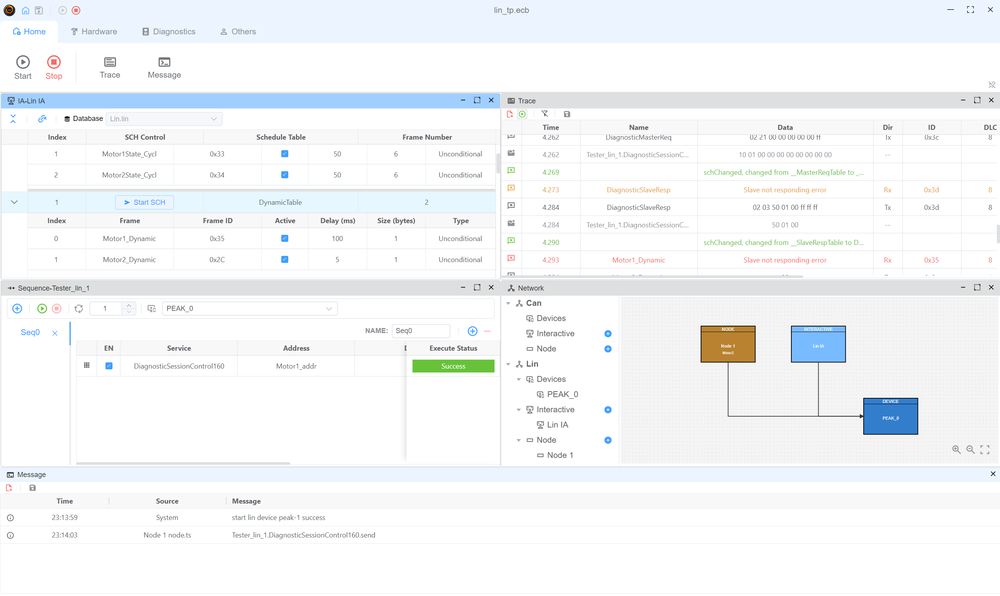

# LIN Master Example

This example demonstrates how to use the LIN protocol to work as a LIN master and simulate a Motor2 node.


## Used Devices
PEAK

## Windows

* LIN IA: control lin schedule table
* Sequence-Tester_lin_1: send diagnostic request
* Trace: view the LIN frames
* Network: view the LIN network coonection




## Node Script
Motor2 will simulate the LIN node. The LIN node will send the response when receiving the request.
On pressing the 'c' key, the LIN node will send a save configuration request.

```typescript
import { DiagResponse, DiagRequest, ServiceItem, outputLin, LinDirection, LinChecksumType } from "ECB";

Util.On("Tester_lin_1.DiagnosticSessionControl160.send", async (v) => {
    console.log("Tester_lin_1.DiagnosticSessionControl160.send")
    const resp = DiagResponse.fromDiagRequest(v)
    await resp.outputDiag()
})

Util.OnKey('c', async () => {
    await outputLin({
        frameId: 0x3c,
        data: Buffer.from([2, 1, 0xb6, 0xff, 0xff, 0xff, 0xff, 0xff]),
        direction: LinDirection.SEND,
        checksumType: LinChecksumType.CLASSIC
    })
})
