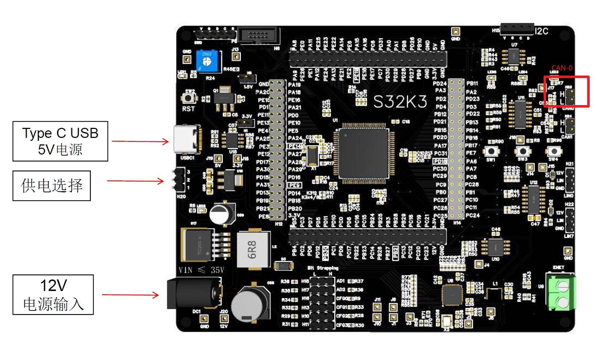
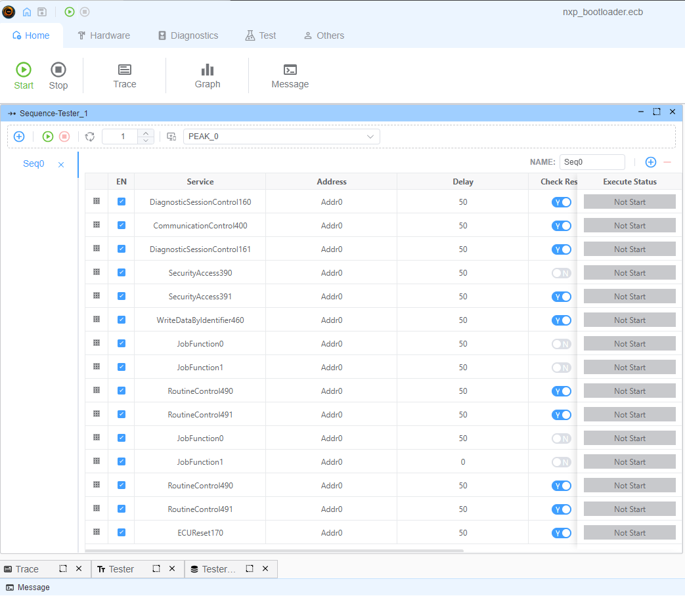

# NXP Bootloader Example

- Interface: `CAN`
- Vendor Device: `PEAK`
- Test Board: [S32K344/324/314大开发板EVB评估板](https://item.taobao.com/item.htm?abbucket=19&id=740622398903&ns=1&pisk=foBIpV2TH20CwzFUG0Ew5MELoK95FawqR0tRmgHE2pppy1scPerutp56PNQ6Jvr3tQL5-pdlTU8ePLslllz43-ShxLvTury2-9WlzK0KvX3yXVKWtPrZ7-ShxUmIyo5T34GtHzkKwUQJBCKDALnpvBE6BnxXevd-pf39SFLJeUL-6VK2qYhpya39X3x223LK9ce9q3vJyap-wku64WtRAlu6g--gKeSp5xsGCHLstMTseY611BTA3FM-eOtdjWT25xNyksYegEbTQv95X3_6g6ajdasRm_d1F2EFkgQhCpvbakAf6152O1aKFFWeVIpJ10HRfdTGlTpYHVtG6M5RKwiSeHXF3QTD1uHkadB2MsQIqoj9p3QkiTzmKeIRmtf2hJgDA1IXCg-o3ENK9bi6iYt6ulZsZbX7XcDfljopZBKMv-r_fVGk9hxtlTrsOXRpjhP8flgLf&priceTId=213e363a17316432955378124eef04&skuId=5466402150063&spm=a21n57.1.item.3.3173523c0cLCx7&utparam=%7B%22aplus_abtest%22%3A%22b157c0e4b60c27af3bd36a542bb06f7a%22%7D&xxc=taobaoSearch), or NXP S32K344EVB.
  
- Ecu Code: [NXP Bootloader](https://community.nxp.com/t5/S32K-Knowledge-Base/Unified-bootloader-Demo/ta-p/1423099)

## Description

This example demonstrates how to use the EcuBus-Pro to upgrade Application firmware through UDS CAN protocol. This example use PEAK as USB-CAN adapter.

## CAN Configuration

- CAN
- Baudrate: 500Kbps
- TX ID: 0x784
- RX ID: 0x7f0

## Connection

| PEAK | S32K344大开发板EVB评估板 |
| ---- | ------------------------ |
| CANH | CAN0 H23-1               |
| CANL | CAN0 H23-2               |

## Usage

1. Download the [NXP Bootloader](https://community.nxp.com/t5/S32K-Knowledge-Base/Unified-bootloader-Demo/ta-p/1423099).
   1. The download demo is based on old EcuBus tool, which is deprecated. The new EcuBus-Pro tool has more features and better performance.
2. If you use the `NXP S32K344EVB`, you can directly download the firmware. If you use the `S32K344大开发板EVB评估板`, you need to modify the LPUART pins and LED pins.
3. Connect the PEAK USB-CAN adapter to the computer, and connect the PEAK USB-CAN adapter to the S32K344 board.
4. Run the Sequence-Tester_1.

---

## Diagnostic Steps



This example implements firmware upgrade through UDS diagnostic protocol. The main steps are as follows:

1. Session Control and Communication Control

   - DiagnosticSessionControl (0x10) switch to programming session (0x03)
   - CommunicationControl (0x28) disable normal communication (controlType=0x03)
   - DiagnosticSessionControl (0x10) switch to extended session (0x02)

2. Security Access

   - SecurityAccess (0x27, subfunction=0x01) request seed
   - SecurityAccess (0x27, subfunction=0x02) send key
   - Key calculation uses AES-128-CBC algorithm, key is [0-15], IV is all zeros

3. Write Identifier

   - WriteDataByIdentifier (0x2E, DID=0xF15A) write specific identifier

4. Download Program
   For each firmware file:

   1. RequestDownload (0x34) request download, specify memory address and size
   2. RoutineControl (0x31, routineId=0x0202) verify CRC
   3. TransferData (0x36) transfer data in blocks
   4. RequestTransferExit (0x37) end transfer

5. Firmware Verification and Reset
   - RoutineControl (0x31, routineId=0xFF00) verify firmware
   - RoutineControl (0x31, routineId=0xFF01) verification complete
   - ECUReset (0x11) reset ECU

## Firmware Files

The example includes two firmware files:

1. S32K344_FlsDrvRTD100.bin

   - Download Address: 0x20000010
   - Driver firmware

2. S32K344_CAN_App_RTD200.bin
   - Download Address: 0x00440200
   - Application firmware

## Notes

1. Ensure firmware files are placed in the project's bin directory
2. Do not disconnect or power off during download
3. If download fails, you can retry the entire process
4. Each firmware file needs CRC verification

---

**[Demo Video](https://www.bilibili.com/video/BV1KcmfYNEkQ)**

## Script Implementation Details

The bootloader.ts script implements the diagnostic sequence. Here's a detailed explanation of each part:

### Initialization and Imports

```typescript
import crypto from 'crypto'
import { CRC, DiagRequest, DiagResponse } from 'ECB'
import path from 'path'
import fs from 'fs/promises'
```

- Imports required modules for cryptography, CRC calculation, and file operations
- `ECB` provides UDS diagnostic communication utilities

### Configuration

```typescript
const crc = new CRC('self', 16, 0x3d65, 0, 0xffff, true, true)
let maxChunkSize: number | undefined = undefined
let content: undefined | Buffer = undefined
```

- Configures CRC-16 calculator for firmware verification
- Variables to store transfer block size and firmware content

### Firmware Files Configuration

```typescript
const fileList = [
  {
    addr: 0x20000010,
    file: path.join(process.env.PROJECT_ROOT, 'bin', 'S32K344_FlsDrvRTD100.bin')
  },
  {
    addr: 0x00440200,
    file: path.join(process.env.PROJECT_ROOT, 'bin', 'S32K344_CAN_App_RTD200.bin')
  }
]
```

- Defines firmware files to be downloaded with their target addresses

### Initialization Handler

```typescript
Util.Init(async () => {
  const req = DiagRequest.from('Tester_1.RoutineControl491')
  req.diagSetParameter('routineControlType', 1)
  await req.changeService()
  const resp = DiagResponse.from('Tester_1.RoutineControl491')
  resp.diagSetParameter('routineControlType', 1)
  await resp.changeService()
})
```

- Modifies RoutineControl491 service to use type 1 (start routine)
- Updates both request and response parameters

### Security Access Handler

```typescript
Util.On('Tester_1.SecurityAccess390.recv', async (v) => {
  const data = v.diagGetParameterRaw('securitySeed')
  const cipher = crypto.createCipheriv(
    'aes-128-cbc',
    Buffer.from([0, 1, 2, 3, 4, 5, 6, 7, 8, 9, 10, 11, 12, 13, 14, 15]),
    Buffer.alloc(16, 0)
  )
  let encrypted = cipher.update(data)
  cipher.final()
  const req = DiagRequest.from('Tester_1.SecurityAccess391')
  req.diagSetParameterSize('data', 128)
  req.diagSetParameterRaw('data', encrypted)
  await req.changeService()
})
```

- Handles security access seed-key exchange
- Uses AES-128-CBC to calculate key from received seed
- Sends calculated key back to ECU

### Download Process Handlers

```typescript
Util.Register('Tester_1.JobFunction0', async () => {
  // Prepare next firmware file for download
  const item = fileList.shift()
  if (item) {
    // Request download and verify CRC
    // Returns array of requests to be sent
  }
  return []
})

Util.Register('Tester_1.JobFunction1', () => {
  // Handle actual data transfer
  // Splits firmware into chunks and sends them
  // Ends with transfer exit request
  // Returns array of requests to be sent
})
```

- JobFunction0: Prepares download by:
  1. Getting next firmware file
  2. Setting up download request with correct address
  3. Calculating and verifying CRC
- JobFunction1: Handles data transfer by:
  1. Splitting firmware into appropriate chunk sizes
  2. Creating TransferData requests for each chunk
  3. Adding RequestTransferExit at the end
  4. Triggering firmware verification after last file

The script works in conjunction with the sequence defined in the ECB file, which executes:

1. Session and communication control services
2. Security access sequence
3. JobFunction0 to prepare download
4. JobFunction1 to transfer data
5. Final verification and reset
