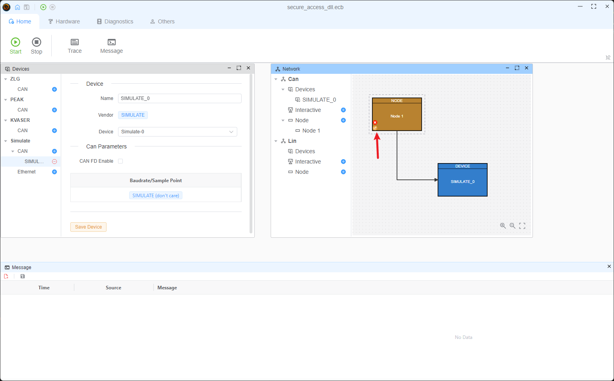
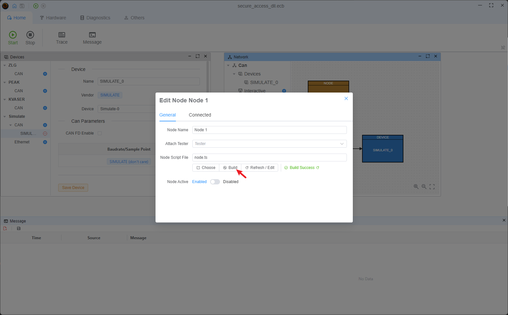
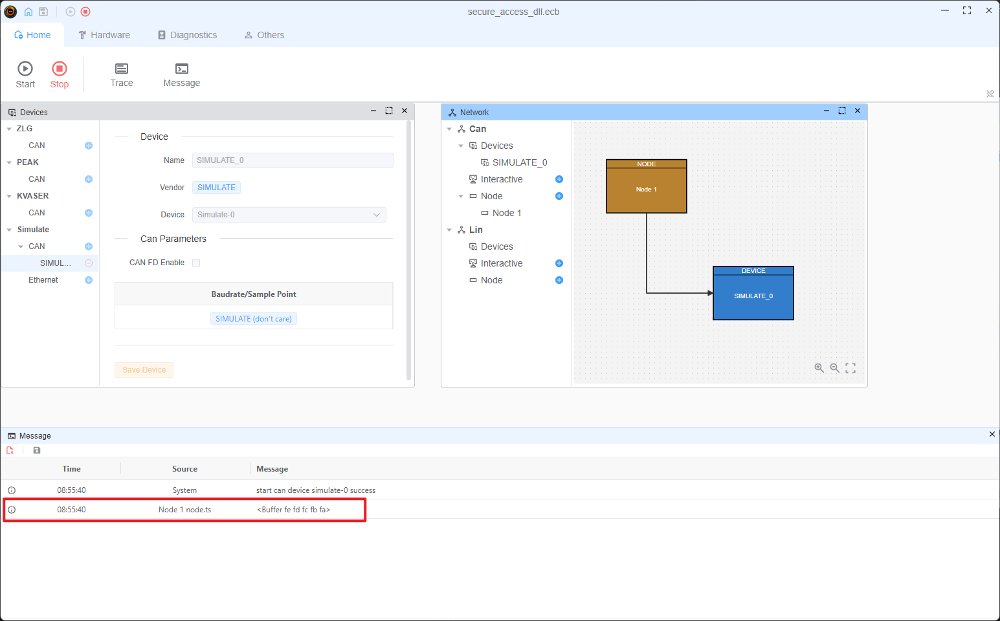

# Secure Access DLL Example

* Interface: `CAN`
* Vendor Device: `Simulate`

## Build The DLL

You can do it with yourself method, or you can cmake. (only support x64 platform)

* open vs x64_x86 cross tools command prompt terminal
* cd SeedKey
* mkdir build
* cd build
* cmake .. -A x64
* cmake --build . --config Release

`dll` folder contains the pre-built dll file.

## Use The DLL

The project setup a simulate device, which can be used to test the dll. A node item attach the script(`node.ts`)
> [!TIP]
> Need x64 platform dll file

```typescript
import {SecureAccessDll} from 'ECB'
import path from 'path';

//setup dll 
const sa= new SecureAccessDll(path.join(process.env.PROJECT_ROOT,'dll','GenerateKeyEx.dll'));
//call the function
const seed=sa.GenerateKeyEx(Buffer.from([1,2,3,4,5]),1,Buffer.from([1,2,3,4,5]),Buffer.from([1,2,3,4,5]))
console.log(seed)

```

## Steps





## Others

The default dll warper follow the [Guide](https://cdn.vector.com/cms/content/know-how/_application-notes/AN-IDG-1-017_SecurityAccess.pdf), if you want to use other interface, you can build the wrapper by yourself. See the [source code](https://github.com/ecubus/EcuBus-Pro/tree/master/src/main/worker/secureAccess) for more information.
