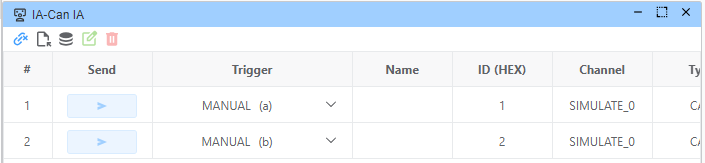
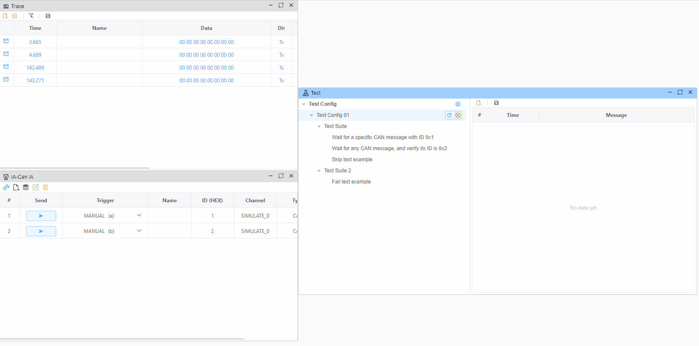
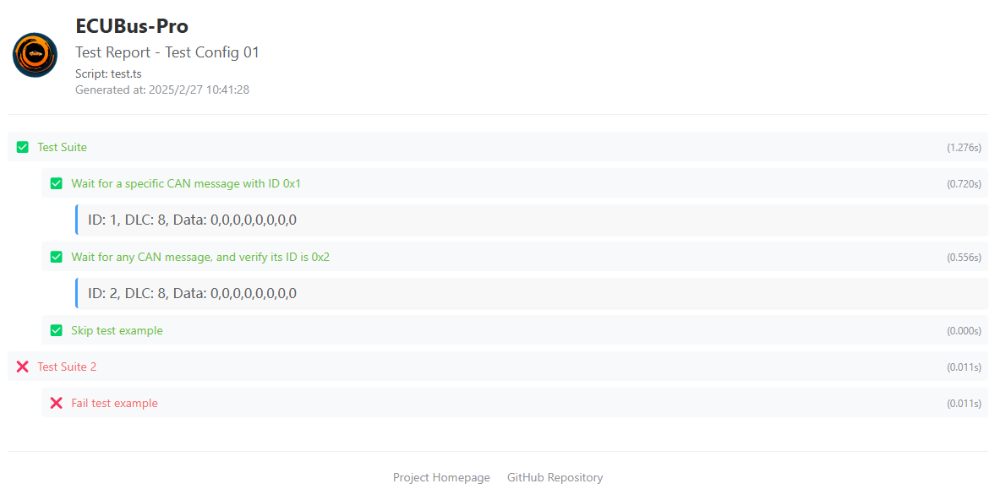
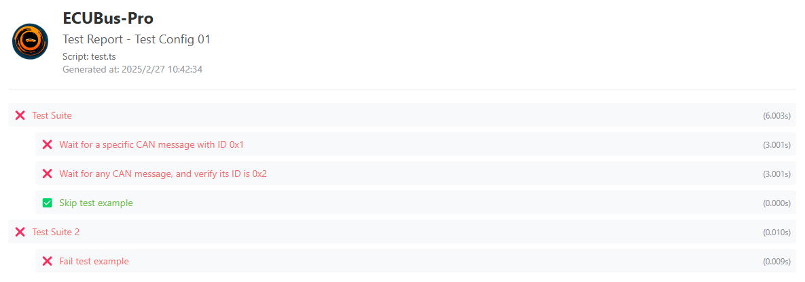

# Test Simple

About test framework, see UM [Test](../../../docs/um/test/test.md)
- Interface: `CAN`
- Vendor Device: `Simulate`
- Test Script: test.ts
```typescript
import { describe, test, assert, CanMessage } from 'ECB'

/**
 * Utility function to wait for a specific CAN message
 * @param id - The CAN message ID to wait for, or true to accept any message
 * @param timeout - Maximum time to wait in milliseconds (defaults to 1000ms)
 * @returns Promise that resolves with the received CAN message
 */
const TestWaitForMessage = async (id: number | true, timeout: number = 1000) => {
  return new Promise<CanMessage>((resolve, reject) => {
    // Set timeout to reject the promise if no message is received
    const timer = setTimeout(() => {
      reject(new Error('timeout'))
    }, timeout)
    // Register one-time handler for the specified CAN message ID
    Util.OnCanOnce(id, (msg) => {
      clearTimeout(timer)
      console.log(
        `ID: ${msg.id}, DLC: ${msg.data.length}, Data: ${msg.data.toString('hex').toUpperCase()}`
      )
      resolve(msg)
    })
  })
}

// Main test suite
describe('Test Suite', () => {


  test('Wait for a specific CAN message with ID 0x1', async () => {
    await TestWaitForMessage(0x1, 3000)
    assert(true)
  })

  // Test case that waits for any CAN message and verifies its ID is 0x2
  test('Wait for any CAN message, and verify its ID is 0x2', async () => {
    const msg = await TestWaitForMessage(true, 3000)
    assert(msg.id == 0x2)
  })

  // Skipped test case that would otherwise pass immediately
  test.skip('Skip test example', async () => {
    assert(true)
  })
})

// Second test suite
describe('Test Suite 2', () => {
  // Simple test case that passes immediately
  test('Fail test example', () => {
    assert(false)
  })
})
```
- CAN-IA
  - ID (1), press a to send
  - ID (2), press  to send


## Example Success
need press a in `Wait for a specific CAN message with ID 0x1`
and press b in `Wait for any CAN message, and verify its ID is 0x2`



## Example Fail
don't press any key, will timeout in `Wait can frame`

