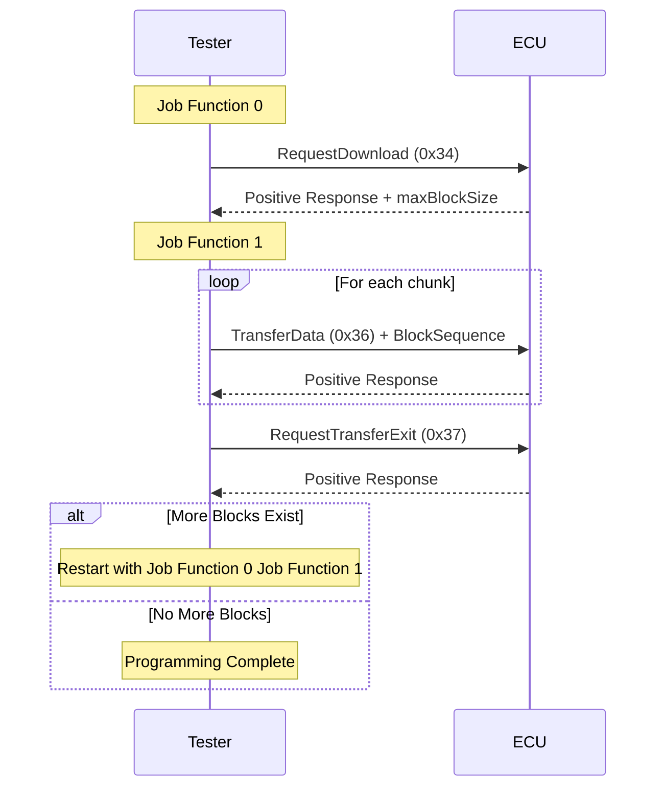

# UDS Hex File Programming Example

This example demonstrates how to program a hex file into an ECU using UDS (Unified Diagnostic Services) protocol. The project shows how to use `HexMemoryMap` to parse a hex file and program it into an ECU using block transfer.

## Overview

The example implements a programming sequence using the following UDS services:

- RequestDownload (0x34)
- TransferData (0x36)
- RequestTransferExit (0x37)

## Tester Config

### Tester (tester.ts)


### Service

- 0x34
- 0x36
- 0x37


### Sequence


## `tester.ts` Implementation Details

### HexMemoryMap Usage

The project uses `HexMemoryMap` to parse an Intel HEX file:

```typescript
const hexFile = path.join(process.env.PROJECT_ROOT, 'Hello_World.hex')
const hexStr = await fsP.readFile(hexFile, 'utf8')
const map = HexMemoryMap.fromHex(hexStr)
// Convert hex data into memory blocks
for (const [addr, data] of map) {
  pendingBlocks.push({ addr, data })
}
```

More details about `HexMemoryMap` can be found in the [API documentation](https://app.whyengineer.com/scriptApi/scriptApi/classes/HexMemoryMap.html).

### Programming Flow

The programming process is divided into two main job functions:

#### Job Function 0 (Initial Request)

- Reads the next memory block to be programmed
- Sends RequestDownload (0x34) service with memory address and size
- Gets maximum block size from ECU response

```typescript
const r34 = DiagRequest.from('Tester.RequestDownload520')
const memoryAddress = Buffer.alloc(4)
memoryAddress.writeUInt32BE(currentBlock.addr)
r34.diagSetParameterRaw('memoryAddress', memoryAddress)
r34.diagSetParameter('memorySize', currentBlock.data.length)
```

#### Job Function 1 (Data Transfer)

- Splits data into chunks based on maxChunkSize
- Sends TransferData (0x36) for each chunk
- Sends RequestTransferExit (0x37) after all chunks
- Restarts process if more blocks exist

### Key Features

1. **Dynamic Block Size Adjustment**

   - Adjusts block size based on ECU capabilities
   - Aligns to 8-byte boundaries for optimal transfer

   ```typescript
   maxChunkSize -= 2 // Account for block sequence counter
   if (maxChunkSize & 0x07) {
     maxChunkSize -= maxChunkSize & 0x07
   }
   ```

2. **Block Sequence Counter**

   - Implements 1-255 rolling counter for block tracking

   ```typescript
   const blockSequenceCounter = Buffer.alloc(1)
   blockSequenceCounter.writeUInt8((i + 1) & 0xff)
   ```

3. **Automatic Block Management**
   - Queues multiple memory blocks
   - Handles transitions between blocks automatically
   - Restarts programming sequence for each block

## Flow Diagram



## ECU Simulation

`Node 1(ecu.ts)` simulation that responds to the programming requests. The ECU side handles three main services:


### 1. RequestDownload (0x34) Response

```typescript
Util.On('Tester.RequestDownload520.send', async (req) => {
  const resp = DiagResponse.fromDiagRequest(req)
  // Response: 0x74 (positive response)
  // 0x40: length format identifier
  // 0x00000081: maxNumberOfBlockLength (129 bytes)
  resp.diagSetRaw(Buffer.from([0x74, 0x40, 0, 0, 0, 0x81]))
  await resp.outputDiag()
})
```

- Responds with positive response (0x74)
- Specifies maximum block length (129 bytes)
- Uses length format identifier 0x40

### 2. TransferData (0x36) Response

```typescript
Util.On('Tester.TransferData540.send', async (req) => {
  const resp = DiagResponse.fromDiagRequest(req)
  // Response: 0x76 (positive response) + block sequence counter
  resp.diagSetRaw(Buffer.from([0x76, Number(req.diagGetParameter('blockSequenceCounter'))]))
  await resp.outputDiag()
})
```

- Acknowledges each data block with positive response (0x76)
- Echoes back the block sequence counter
- Simulates successful data transfer

### 3. RequestTransferExit (0x37) Response

```typescript
Util.On('Tester.RequestTransferExit550.send', async (req) => {
  const resp = DiagResponse.fromDiagRequest(req)
  // Response: 0x77 (positive response)
  resp.diagSetRaw(Buffer.from([0x77]))
  await resp.outputDiag()
})
```

- Confirms completion of transfer with positive response (0x77)
- Simulates successful programming completion

The ECU simulation provides a complete test environment for the programming sequence, allowing developers to test their programming implementation without actual hardware.

## Demo


